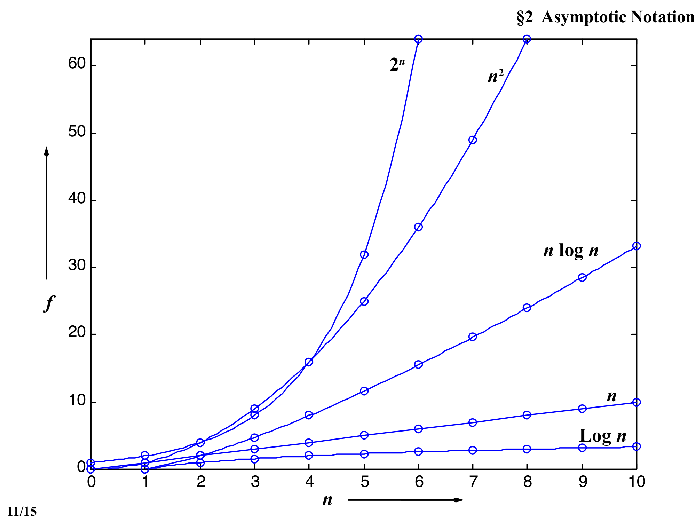
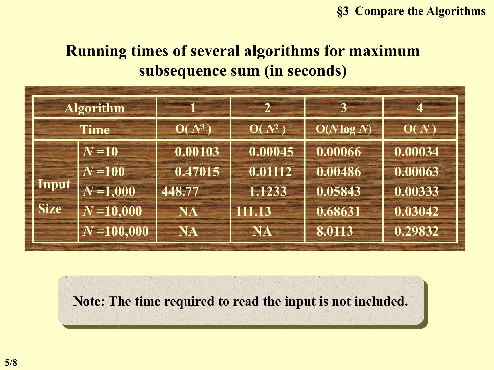
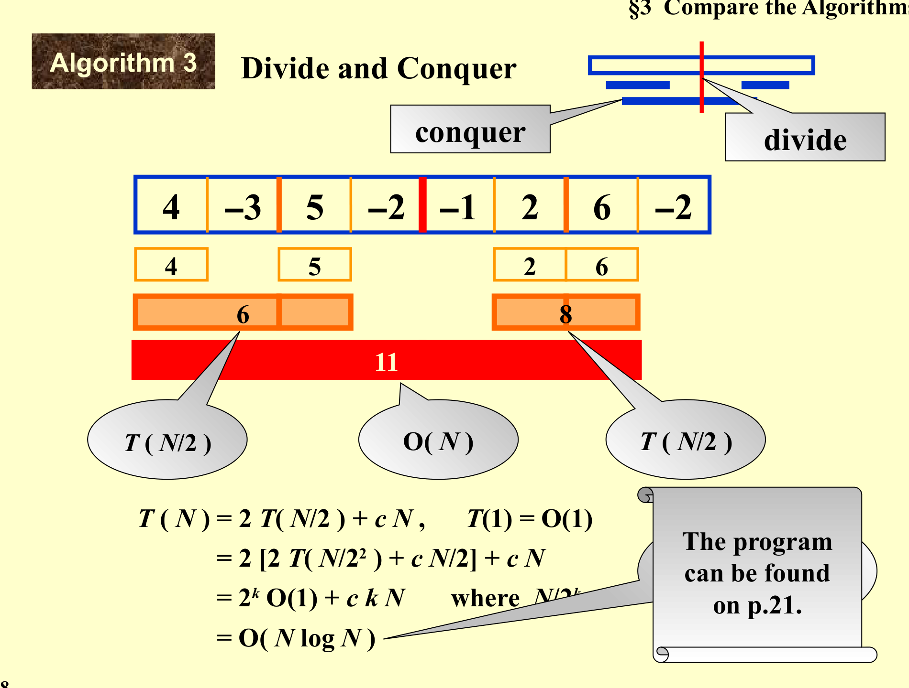
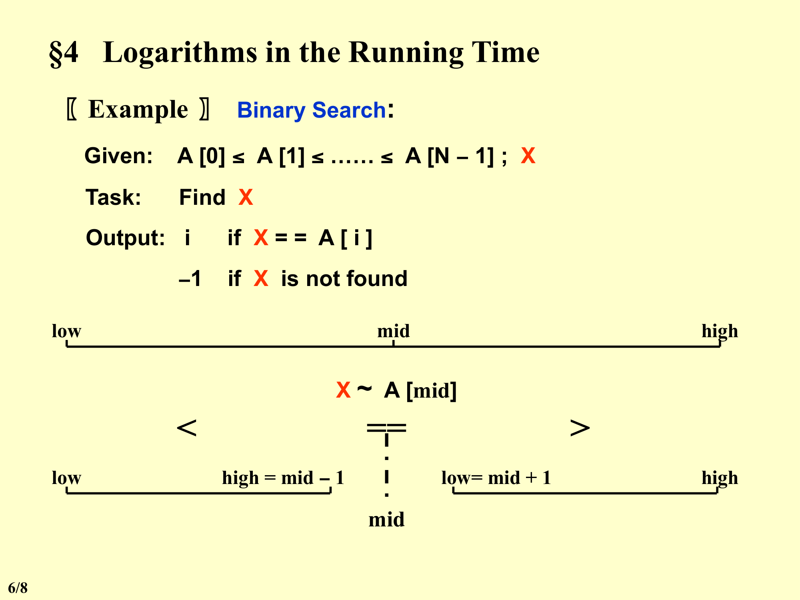

# 第2章：算法分析 (Chapter 2: Algorithm Analysis)

---

## 1. 算法的定义 (Definition of Algorithm)

**【定义 (Definition)】** **算法 (Algorithm)** 是一个有限的指令集合，按照这些指令执行就能完成某一特定任务。所有算法必须满足以下五个准则：

1. **输入 (Input)** —— 有零个或多个从外部提供的量。
2. **输出 (Output)** —— 至少产生一个量。
3. **确定性 (Definiteness)** —— 每一条指令都清晰且无歧义。
4. **有限性 (Finiteness)** —— 如果我们跟踪算法的指令，对于所有情况，算法都应在有限步之后终止。
5. **有效性 (Effectiveness)** —— 每一条指令都必须足够基本，原则上能够由一个人仅用纸笔完成。仅仅每条操作是确定的（如准则3所述）还不够；还必须是可行的。

> **Definition**: An algorithm is a finite set of instructions that, if followed, accomplishes a particular task. All algorithms must satisfy the following criteria: Input, Output, Definiteness, Finiteness, Effectiveness.

### 算法 vs. 程序 (Algorithms vs. Programs)

- **程序 (Program)** 是用某种编程语言编写的，并且**不必**是有限的（例如，操作系统会无限期运行）。
- **算法** 可以用人类语言、流程图、某种编程语言或伪代码来描述。

### 示例：选择排序 (Selection Sort)

将一组 $n \ge 1$ 的整数按递增顺序排序。

**思路 (Idea)：** 在当前未排序的整数中，找出最小的那个，并将其放到已排序列表的下一个位置。

```
for ( i = 0; i < n; i++ ) {
    检查 list[i] 到 list[n-1]，假设最小整数位于 list[min];
    交换 list[i] 和 list[min];
}
```

**用文字描述 (Description in Words)：** 排序 = 找出最小整数 + 将其与 list[i] 交换。

---

## 2. 分析什么 (What to Analyze)

### 两种复杂度 (Two Kinds of Complexity)

| 类型 | 描述 |
|------|------|
| **依赖于机器和编译器的运行时间** | 实际运行时间取决于硬件、编译器等因素 |
| **时间与空间复杂度 (Time and Space Complexity)** | 与机器和编译器无关的度量 |

### 分析中的假设 (Assumptions in Analysis)

1. 指令**顺序 (Sequentially)** 执行。
2. 每条指令都是**简单 (Simple)** 的，并且恰好花费**一个时间单位 (One Time Unit)**。
3. 整数大小**固定 (Fixed)**，并且我们拥有**无限内存 (Infinite Memory)**。

### 通常分析的函数 (Functions Typically Analyzed)

- $T_{avg}(N)$ —— 作为输入规模 $N$ 的函数的**平均情况 (Average Case)** 时间复杂度。
- $T_{worst}(N)$ —— 作为输入规模 $N$ 的函数的**最坏情况 (Worst Case)** 时间复杂度。

如果存在多个输入，这些函数可能具有多个参数。

---

### 示例：矩阵加法 (Matrix Addition)

```c
void add( int a[][MAX_SIZE],
          int b[][MAX_SIZE],
          int c[][MAX_SIZE],
          int rows, int cols )
{
    int i, j;
    for ( i = 0; i < rows; i++ )          /* rows + 1 */
        for ( j = 0; j < cols; j++ )      /* rows * (cols + 1) */
            c[i][j] = a[i][j] + b[i][j];  /* rows * cols */
}
```

**步数统计 (Step Count)：**
- 外层循环：`rows + 1`（包括最后一次失败的条件判断）
- 内层循环初始化：`rows * (cols + 1)`
- 内层赋值：`rows * cols`

$$T(rows, cols) = 2 \cdot rows \cdot cols + 2 \cdot rows + 1$$

> **注意 (Note)：** 如果 $rows \gg cols$，交换 rows 和 cols 可以提高性能。

---

### 示例：迭代求和 (Iterative Summation)

```c
float sum( float list[], int n )
{   /* 对列表中的数求和 */
    float tempsum = 0;          /* count = 1 */
    int i;
    for ( i = 0; i < n; i++ )   /* count++ */
        tempsum += list[i];     /* count++ */
    return tempsum;             /* for 最后一次执行时 count++ */
}
```

$$T_{sum}(n) = 2n + 3$$

---

### 示例：递归求和 (Recursive Summation)

```c
float rsum( float list[], int n )
{   /* 对列表中的数求和 */
    if ( n )                         /* count++ */
        return rsum(list, n-1) + list[n-1];  /* count++ */
    return 0;                        /* count++ */
}
```

$$T_{rsum}(n) = 2n + 2$$

> **重要：** 虽然在数值上 $2n+2 < 2n+3$，但递归函数由于函数调用的开销，**计算每一步**需要更多时间。如果尝试较大的 $n$，你会发现递归版本实际上更慢！

### 关键洞察 (Key Insight)

精确计算步数**过于复杂**，并且并不总是值得的。我们真正关心的是运行时间随输入规模变化的**增长率 (Growth Rate)**——即**渐近行为 (Asymptotic Behavior)**。

---

## 3. 渐近记号 (Asymptotic Notation)（$O$, $\Omega$, $\Theta$, $o$）

统计步数的目的是**预测运行时间随 $N$ 变化的增长趋势**，从而比较两个程序的时间复杂度。我们真正想知道的是 $T_p$ 的**渐近行为**。

**关键洞察：** 假设 $T_{p1}(N) = c_1 N^2 + c_2 N$ 且 $T_{p2}(N) = c_3 N$。无论 $c_1, c_2, c_3$ 取何值，总存在一个 $n_0$，使得对所有 $N > n_0$ 都有 $T_{p1}(N) > T_{p2}(N)$。因此，只要我们知道了 $T_{p1}$ 大约是 $N^2$ 而 $T_{p2}$ 大约是 $N$，那么对于足够大的 $N$，$P_2$ 会更快。

### 形式化定义 (Formal Definition)

#### 大-Oh (Big-Oh)：$T(N) = O(f(N))$

**【定义 (Definition)】** 如果存在**正常数 (Positive Constants)** $c$ 和 $n_0$，使得对所有 $N \ge n_0$ 有：

$$T(N) \le c \cdot f(N)$$

则称 $T(N) = O(f(N))$。

> **Definition**: $T(N) = O(f(N))$ if there exist positive constants $c$ and $n_0$ such that $T(N) \le c \cdot f(N)$ for all $N \ge n_0$.

这给出了增长率的**上界 (Upper Bound)**。

#### 大-Omega (Big-Omega)：$T(N) = \Omega(g(N))$

**【定义 (Definition)】** 如果存在**正常数 (Positive Constants)** $c$ 和 $n_0$，使得对所有 $N \ge n_0$ 有：

$$T(N) \ge c \cdot g(N)$$

则称 $T(N) = \Omega(g(N))$。

> **Definition**: $T(N) = \Omega(g(N))$ if there exist positive constants $c$ and $n_0$ such that $T(N) \ge c \cdot g(N)$ for all $N \ge n_0$.

这给出了增长率的**下界 (Lower Bound)**。

#### 大-Theta (Big-Theta)：$T(N) = \Theta(h(N))$

**【定义 (Definition)】** $T(N) = \Theta(h(N))$ **当且仅当** $T(N) = O(h(N))$ **且** $T(N) = \Omega(h(N))$。

> **Definition**: $T(N) = \Theta(h(N))$ if and only if $T(N) = O(h(N))$ and $T(N) = \Omega(h(N))$.

这给出了一个**紧界 (Tight Bound)**——该函数与 $h(N)$ 的**增长完全相同**（在常数因子范围内）。

#### 小-oh (Little-oh)：$T(N) = o(p(N))$

**【定义 (Definition)】** 如果 $T(N) = O(p(N))$ 且 $T(N) \neq \Theta(p(N))$，则称 $T(N) = o(p(N))$。

> **Definition**: $T(N) = o(p(N))$ if $T(N) = O(p(N))$ and $T(N) \neq \Theta(p(N))$.

这意味着 $T(N)$ 的增长率**严格慢于 (Strictly Slower)** $p(N)$。

### 关于记号的重要说明 (Important Notes on Notation)

- **大-Oh 惯例 (Big-Oh Convention)（最小上界）：** $2N + 3 = O(N) = O(N^{k \ge 1}) = O(2^N) = \cdots$ 我们总是取**最小**的 $f(N)$。
- **大-Omega 惯例 (Big-Omega Convention)（最大下界）：** $2N + N^2 = \Omega(2N) = \Omega(N^2) = \Omega(N) = \Omega(1) = \cdots$ 我们总是取**最大**的 $g(N)$。

---

### 增长率图示 (Growth Rate Diagram)（来自幻灯片）



图示（幻灯片 11）展示了常见函数的相对增长率：

- **Log n** 增长最慢
- **n** 线性增长
- **n log n** 比 n 增长快，但比 n^2 慢
- **n^2** 平方增长
- **2^n** 指数增长——最快

**按增长率排序（从慢到快）：**

$$\log n \ll n \ll n \log n \ll n^2 \ll 2^n$$

---

### 渐近记号的规则

#### 规则 1：加法与乘法 (Addition and Multiplication)

如果 $T_1(N) = O(f(N))$ 且 $T_2(N) = O(g(N))$，则：

- **(a)** $T_1(N) + T_2(N) = \max(O(f(N)), O(g(N)))$
  - 和由**较大**的项主导。
- **(b)** $T_1(N) \cdot T_2(N) = O(f(N) \cdot g(N))$
  - 积相乘。

#### 规则 2：多项式 (Polynomials)

如果 $T(N)$ 是一个 **$k$ 次多项式**，则：

$$T(N) = \Theta(N^k)$$

#### 规则 3：对数增长 (Logarithmic Growth)

$$\log^k N = O(N) \quad \text{对于任意常数 } k$$

这说明**对数增长非常缓慢**——即使是对数多项式函数也比 $N$ 的任何正幂次增长得慢。

#### 规则 4：足够大的 N (Sufficiently Large N)

在渐近地比较两个程序的复杂度时，确保 $N$ **足够大**。

**示例：** 假设 $T_{p1}(N) = 10^6 N$ 且 $T_{p2}(N) = N^2$。虽然 $\Theta(N^2)$ 比 $\Theta(N)$ 增长更快，但如果 $N < 10^6$，实际上 $P_2$ 仍然**快于** $P_1$。

---

### 增长率与时间表 (Growth Rates and Time Table)

下表显示了给定时间复杂度的算法处理规模为 $n$ 的输入所需的时间，假设每个操作耗时 $1 \mu s$（微秒 $= 10^{-6}$ 秒）。

**单位 (Units)：** $\mu s = 10^{-6}$ 秒, $ms = 10^{-3}$ 秒, $sec = 秒$, $min = 分钟$, $hr = 小时$, $d = 天$, $yr = 年$

| n | O(log n) | O(n) | O(n log n) | O(n^2) | O(2^n) |
|---|----------|------|------------|--------|--------|
| 小 | 瞬间 | 快 | 中等 | 慢 | 不可行 |
| 中 | 瞬间 | 中等 | 中等 | 慢 | 不可行 |
| 大 | 瞬间 | 慢 | 慢 | 非常慢 | 不可能 |



*（关键结论：指数级算法会很快变得不可用，而对数级算法即使面对极大输入也依然快速。）*

---

### 示例：矩阵加法 (Asymptotic Analysis)（渐近分析）

```c
void add( int a[][MAX_SIZE],
          int b[][MAX_SIZE],
          int c[][MAX_SIZE],
          int rows, int cols )
{
    int i, j;
    for ( i = 0; i < rows; i++ )         /* Θ(rows) */
        for ( j = 0; j < cols; j++ )     /* Θ(rows * cols) */
            c[i][j] = a[i][j] + b[i][j]; /* Θ(rows * cols) */
}
```

$$T(rows, cols) = \Theta(rows \cdot cols)$$

---

## 4. 分析运行时间的一般规则 (General Rules for Analyzing Running Time)

### 规则 1：FOR 循环 (FOR Loop)

一个 `for` 循环的运行时间**最多**是循环内部语句（包括条件判断）的运行时间**乘以**迭代次数。

### 规则 2：嵌套 FOR 循环 (Nested FOR Loop)

嵌套循环组中内部语句的总运行时间，是该语句的运行时间**乘以**所有 `for` 循环的规模之**积**。

### 规则 3：连续语句 (Consecutive Statements)

连续语句的运行时间**相加**（这意味着**最大值**才是起作用的——常数在渐近记号中被忽略）。

### 规则 4：IF / ELSE

对于以下片段：

```
if ( Condition )   S1;
else               S2;
```

运行时间**不超过** **条件判断**的运行时间加上 $S_1$ 和 $S_2$ 中运行时间的**较大者**。

### 规则 5：递归 (Recursion)

#### 示例：斐波那契数 (Fibonacci Numbers)

$$Fib(0) = Fib(1) = 1, \quad Fib(n) = Fib(n-1) + Fib(n-2)$$

```c
long int Fib( int N )
{
    if ( N <= 1 )
        return 1;          /* O(1) */
    else
        return Fib(N-1) + Fib(N-2);  /* T(N-1) + T(N-2) */
}
/* T(N) */
```

**递推关系 (Recurrence Relation)：**

$$T(N) = T(N-1) + T(N-2) + 2$$

**分析 (Analysis)：**
- $T(N) \ge Fib(N)$（可通过归纳法证明）
- $Fib(N)$ **指数增长**
- 因此，$T(N)$ **指数增长**——这是一个非常糟糕（低效）的算法！

> **问题 (Problem)：** 为什么这么糟糕？因为每次调用又产生两次调用，导致指数级爆炸。相同的子问题被反复计算多次。

---

## 5. 算法比较：最大子序列和 (Maximum Subsequence Sum)

**【问题 (Problem)】** 给定（可能为**负数 (Negative Numbers)**的）整数 $A_1, A_2, \dots, A_N$，求 $\sum_{k=i}^{j} A_k$ 的最大值。如果所有整数都为负数，则最大和为 **0**。

这里介绍四种算法，复杂度从 $O(N^3)$ 到 $O(N)$。

---

### 算法 1：暴力法 (Brute Force)（$O(N^3)$）

```c
int MaxSubsequenceSum( const int A[], int N )
{
    int ThisSum, MaxSum, i, j, k;
/* 1*/  MaxSum = 0;                 /* 初始化最大和为 0 */
/* 2*/  for ( i = 0; i < N; i++ )   /* 从 A[i] 开始 */
/* 3*/      for ( j = i; j < N; j++ ) {   /* 到 A[j] 结束 */
/* 4*/          ThisSum = 0;
/* 5*/          for ( k = i; k <= j; k++ )
/* 6*/              ThisSum += A[k];  /* 计算从 A[i] 到 A[j] 的和 */
/* 7*/          if ( ThisSum > MaxSum )
/* 8*/              MaxSum = ThisSum;  /* 更新最大和 */
            }  /* end for-j and for-i */
/* 9*/  return MaxSum;
}
```

**复杂度 (Complexity)：** $T(N) = O(N^3)$

**分析 (Analysis)：** 三重嵌套循环。对于每个起始下标 $i$ 和结束下标 $j$，都通过第三层循环从头重新计算和。

---

### 算法 2：改进的暴力法 (Improved Brute Force)（$O(N^2)$）

```c
int MaxSubsequenceSum( const int A[], int N )
{
    int ThisSum, MaxSum, i, j;
/* 1*/  MaxSum = 0;                 /* 初始化最大和为 0 */
/* 2*/  for ( i = 0; i < N; i++ ) { /* 从 A[i] 开始 */
/* 3*/      ThisSum = 0;
/* 4*/      for ( j = i; j < N; j++ ) {   /* 到 A[j] 结束 */
/* 5*/          ThisSum += A[j];  /* 增量式地计算从 A[i] 到 A[j] 的和 */
/* 6*/          if ( ThisSum > MaxSum )
/* 7*/              MaxSum = ThisSum;  /* 更新最大和 */
            }  /* end for-j */
        }  /* end for-i */
/* 8*/  return MaxSum;
}
```

**复杂度 (Complexity)：** $T(N) = O(N^2)$

**改进 (Improvement)：** 不再每次从头重新计算和，而是增量式地累加 $A[j]$（复用了从 $A[i]$ 到 $A[j-1]$ 的和）。

---

### 算法 3：分治法 (Divide and Conquer)（$O(N \log N)$）

#### 策略 (Strategy)

1. **分 (Divide)：** 将数组分成两半。
2. **治 (Conquer)：** 递归地求出每一半的最大子序列和。
3. **合 (Combine)：** 求出**跨越**中间点（从左半部分开始，到右半部分结束）的最大和。

整体最大值是以下三者中的最大值：
- 左半部分的最大值
- 右半部分的最大值
- 跨中点最大和

#### 图示说明 (Illustration)



> 上图来自课件，展示了数组 `[4, -3, 5, -2, -1, 2, 6, -2]` 的分治求解过程。
>
> **阅读方式（从下往上看）：**
> 1. 最底层：数组被不断**分 (Divide)** 成单元素
> 2. 中间层：递归**治 (Conquer)**，每个子问题求出自己的最大子序列和（左=6, 右=8）
> 3. 最上层：**合 (Combine)**，求跨中点的最大和（4+7=11），整体 max(6, 8, 11) = 11
>
> **跨中点最大和的计算方式：** 从中点出发，向左扫描求左半最大后缀和 + 向右扫描求右半最大前缀和，两者相加。图中 `4` 和 `7` 分别是向左和向右扫描的结果。

#### 递推关系 (Recurrence Relation)

$$T(N) = 2T(N/2) + cN, \quad T(1) = O(1)$$

#### 求解过程 (Solving Process)

$$
\begin{aligned}
T(N) &= 2T(N/2) + cN \\
     &= 2[2T(N/2^2) + cN/2] + cN \\
     &= 2^k O(1) + ckN \quad \text{其中 } N/2^k = 1 \\
     &= O(N \log N)
\end{aligned}
$$

**复杂度 (Complexity)：** $T(N) = O(N \log N)$（对于 $N \neq 2^k$ 的情况也成立）。

*（完整程序见教材第 21 页。）*

---

### 算法 4：在线算法 (On-line Algorithm)（$O(N)$）

```c
int MaxSubsequenceSum( const int A[], int N )
{
    int ThisSum, MaxSum, j;
/* 1*/  ThisSum = MaxSum = 0;
/* 2*/  for ( j = 0; j < N; j++ ) {
/* 3*/      ThisSum += A[j];
/* 4*/      if ( ThisSum > MaxSum )
/* 5*/          MaxSum = ThisSum;
/* 6*/      else if ( ThisSum < 0 )
/* 7*/          ThisSum = 0;
        }  /* end for-j */
/* 8*/  return MaxSum;
}
```

**复杂度 (Complexity)：** $T(N) = O(N)$

#### 运行过程追踪示例 (Trace Example)

给定数组：`-1, 3, -2, 4, -6, 1, 6, -1`

| j | A[j] | ThisSum（之后） | MaxSum | ThisSum（若 <0 则重置） |
|---|------|-----------------|--------|----------------------|
| 0 | -1   | -1              | 0      | 0 |
| 1 | 3    | 3               | 3      | 3 |
| 2 | -2   | 1               | 3      | 1 |
| 3 | 4    | 5               | 5      | 5 |
| 4 | -6   | -1              | 5      | 0 |
| 5 | 1    | 1               | 5      | 1 |
| 6 | 6    | 7               | 7      | 7 |
| 7 | -1   | 6               | 7      | 6 |

最终答案：**7**

#### 关键特性 (Key Characteristics)

- **在线 (On-line)** 的含义是：在任何时刻，该算法都能就已经读取到的数据正确给出子序列问题的答案。
- 数组 $A[\,]$ 仅被**扫描一次 (Scanned Once)**（从左到右）。
- 这是**最优 (Optimal)** 算法——没有任何算法能优于 $\Omega(N)$，因为每个元素至少必须被检查一次。

---

### 运行时间对比表 (Running Time Comparison)

| 算法 | 时间复杂度 | N=10 | N=100 | N=1,000 | N=10,000 | N=100,000 |
|------|------------|------|-------|---------|----------|-----------|
| **1** | $O(N^3)$ | 0.00103 s | 0.47015 s | 448.77 s | 不适用 | 不适用 |
| **2** | $O(N^2)$ | 0.00045 s | 0.01112 s | 1.1233 s | 111.13 s | 不适用 |
| **3** | $O(N \log N)$ | 0.00066 s | 0.00486 s | 0.05843 s | 0.68631 s | 8.0113 s |
| **4** | $O(N)$ | 0.00034 s | 0.00063 s | 0.00333 s | 0.03042 s | 0.29832 s |

> **注 (Note)：** 读取输入所需的时间**未**包含在内。

**关键观察 (Key Observation)：**
- 算法 4（$O(N)$）几乎线性扩展，处理 N=100,000 仅需约 0.3 秒。
- 算法 1（$O(N^3)$）在 N=1,000 时已不可用（448 秒）。
- 算法 2（$O(N^2)$）在 N=10,000 时变慢（111 秒）。
- 算法 3（$O(N \log N)$）即使对于 N=100,000 仍然实用。

---

## 6. 运行时间中的对数 (Logarithms in Running Time)

### 示例：二分查找 (Binary Search)

#### 问题描述 (Problem Description)

**已知 (Given)：** 一个有序数组 $A[0] \le A[1] \le \dots \le A[N-1]$ 和目标值 $X$。

**任务 (Task)：** 在数组中查找 $X$。

**输出 (Output)：**
- $i$，如果 $X == A[i]$
- $-1$，如果未找到 $X$

#### 算法 (Illustration)（图示说明）



1. 设置 `low = 0`，`high = N-1`。
2. 计算 `mid = (low + high) / 2`。
3. 比较 $X$ 与 $A[mid]$：
   - 如果**相等**：返回 `mid`（找到）。
   - 如果**小于**：设置 `high = mid - 1`（在左半部分查找）。
   - 如果**大于**：设置 `low = mid + 1`（在右半部分查找）。
4. 重复直到 `low > high`（未找到）。

#### 代码实现 (Code Implementation)

```c
int BinarySearch( const ElementType A[], ElementType X, int N )
{
    int Low, Mid, High;
/* 1*/  Low = 0;  High = N - 1;
/* 2*/  while ( Low <= High ) {
/* 3*/      Mid = ( Low + High ) / 2;
/* 4*/      if ( A[Mid] < X )
/* 5*/          Low = Mid + 1;
            else
/* 6*/          if ( A[Mid] > X )
/* 7*/              High = Mid - 1;
                else
/* 8*/              return Mid;  /* 找到 */
        }  /* end while */
/* 9*/  return NotFound;  /* NotFound 定义为 -1 */
}
```

#### 复杂度 (Complexity)

$$T_{worst}(N) = O(\log N)$$

**分析 (Analysis)：** 每次迭代将搜索空间减半。经过 $k$ 次迭代后，搜索空间为 $N / 2^k$。当搜索空间减少到 1 时，有 $N / 2^k = 1$，所以 $k = \log_2 N$。

#### 何时使用二分查找 (When to Use Binary Search)

当数据是**静态的 (Static)**并且**已排序 (Sorted)**时非常有用（例如，在字典中查找单词）。

#### 课后自学作业 (Self-Study Assignment)

- **欧几里得算法 (Euclidean Algorithm)**（用于计算最大公约数）——也是 $O(\log N)$
- **幂运算 (Exponentiation)**（高效的乘幂计算）

---

## 7. 检查你的分析 (Checking Your Analysis)

### 方法 1：比值测试 (Ratio Test)

在实际测量运行时间后，检查比值 $T(2N) / T(N)$：

| 如果 $T(N) = O(f(N))$ | 则 $T(2N) / T(N) \approx$ |
|-----------------------|---------------------------|
| $O(N)$ | 2 |
| $O(N^2)$ | 4 |
| $O(N^3)$ | 8 |
| $O(N \log N)$ | 略大于 2 |
| $O(\log N)$ | 略大于 1 |

### 方法 2：极限测试 (Limit Test)

当 $T(N) = O(f(N))$ 时，检查是否：

$$\lim_{N \to \infty} \frac{T(N)}{f(N)} \to \text{一个正常数}$$

*（见教材第 28 页的示例，图 2.12 和图 2.13。）*

---

## 8. 关键复杂度类别总结 (Summary of Key Complexity Classes)

| 复杂度 | 名称 | 描述 | 示例 |
|--------|------|------|------|
| $O(1)$ | **常数 (Constant)** | 时间不依赖于输入规模 | 数组访问 |
| $O(\log N)$ | **对数 (Logarithmic)** | 每一步将问题规模缩小一个因子 | 二分查找 |
| $O(N)$ | **线性 (Linear)** | 单次遍历数据 | 在线最大子序列和 |
| $O(N \log N)$ | **线性对数 (Linearithmic / Log-Linear)** | 分治法 | 归并排序、算法 3 |
| $O(N^2)$ | **平方 (Quadratic)** | 双重嵌套循环 | 算法 2、冒泡排序 |
| $O(N^3)$ | **立方 (Cubic)** | 三重嵌套循环 | 算法 1 |
| $O(2^N)$ | **指数 (Exponential)** | 对大规模 N 不可行 | 朴素斐波那契 |

---

## 快速参考：渐近记号定义 (Asymptotic Notation Quick Reference)

| 记号 (Notation) | 含义 (Meaning) | 形式化条件 (Formal Condition) |
|------|------|-----------|
| $T(N) = O(f(N))$ | 上界（$\le$） | $\exists c, n_0 > 0: T(N) \le c \cdot f(N) \; \forall N \ge n_0$ |
| $T(N) = \Omega(g(N))$ | 下界（$\ge$） | $\exists c, n_0 > 0: T(N) \ge c \cdot g(N) \; \forall N \ge n_0$ |
| $T(N) = \Theta(h(N))$ | 紧界（$=$） | $T(N) = O(h(N))$ 且 $T(N) = \Omega(h(N))$ |
| $T(N) = o(p(N))$ | 严格慢于（$<$） | $T(N) = O(p(N))$ 且 $T(N) \neq \Theta(p(N))$ |
