# 第3章：线性表、栈与队列 (Chapter 3: Lists, Stacks, and Queues)

## §1 抽象数据类型 (ADT, Abstract Data Type)

**定义：** **数据类型 (Data Type)** = { **对象 (Objects)** } $\cup$ { **操作 (Operations)** }

**示例：** `int = { 0, ±1, ±2, ..., INT_MAX, INT_MIN }` $\cup$ `{ +, -, ×, ÷, %, ... }`

**定义：** **抽象数据类型 (ADT, Abstract Data Type)** 是这样组织的一种数据类型，其中：
- **对象的规格说明 (Specification of Objects)** 和**操作的规格说明 (Specification of Operations)** 与
- **对象的表示 (Representation of Objects)** 和**操作的实现 (Implementation of Operations)** 是**分离的 (Separated)**。

这种分离是抽象的核心思想 —— 用户通过**接口 (Interface)** 与 ADT 交互，无需了解其内部实现方式。

---

## §2 线性表 ADT (List ADT)

### ADT 规约 (ADT Specification)

**对象：** $( \text{item}_0, \text{item}_1, \ldots, \text{item}_{N-1} )$

**操作：**
- 求线性表的**长度 (Length)** $N$。
- **打印 (Print)** 线性表中的所有元素。
- 创建一个**空线性表 (Empty List)**。
- **查找 (Find)** 线性表中的第 $k$ 个元素，$0 \le k < N$。
- 在线性表的第 $k$ 个元素之后**插入 (Insert)** 一个新元素，$0 \le k < N$（注："为什么之后插入？"——这是一个设计选择）。
- **删除 (Delete)** 线性表中的一个元素。
- 查找线性表中当前元素的**下一个 (Next)** 元素。
- 查找线性表中当前元素的**前一个 (Previous)** 元素。

---

### 1. 线性表的简单数组实现 (Simple Array Implementation of List)

$$
\text{array}[i] = \text{item}_i
$$

**图示说明：** 内存中的**顺序映射 (Sequential Mapping)** —— 元素连续存储：
- 地址 `array + i` 存放 `item_i`
- 地址 `array + i + 1` 存放 `item_{i+1}`
- ...

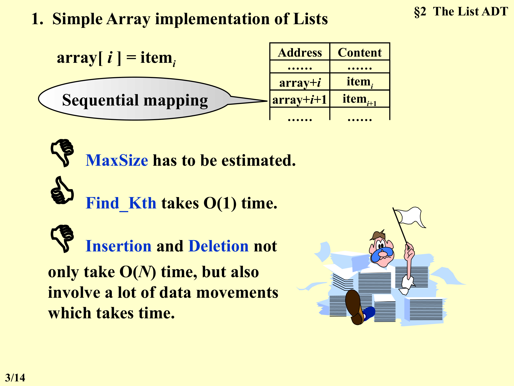

**性质：**
- $\triangle$ **需要事先估计 MaxSize**（如果线性表增长超过数组大小，则需要扩容）。
- $\checkmark$ **查找第 K 个元素时间为 $O(1)$**（直接索引访问）。
- $\triangle$ **插入和删除**不仅需要 $O(N)$ 时间，还涉及大量的**数据移动 (Data Movement)**，这也很耗时（**元素移位, Element Shifting**）。

---

### 2. 链表 (Linked List)

**图示说明：** 每个节点包含：
- **数据 (Data)** 域
- **指针 (Pointer)**（`next`）域，指向下一个节点

示例结构（节点包含姓名）：`ZHAO -> QIAN -> SUN -> LI -> NULL`

内存地址示意图（每次运行位置可能不同）：
```
地址    数据    指针
0010    SUN     1011
0011    QIAN    0010
0110    ZHAO    0011
1011    LI      NULL
```
**头指针 (Head Pointer)** `ptr = 0110`（指向 ZHAO）。

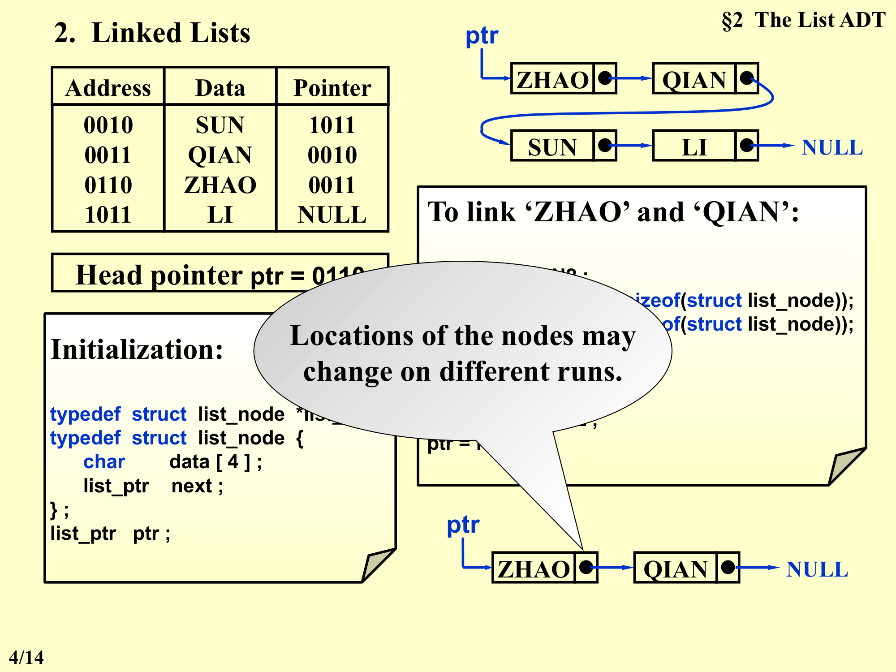

**C 语言中的初始化：**
```c
typedef struct list_node *list_ptr;
typedef struct list_node {
    char     data[4];
    list_ptr next;
};
list_ptr ptr;
```

**链接节点：**
```c
list_ptr N1, N2;
N1 = (list_ptr)malloc(sizeof(struct list_node));
N2 = (list_ptr)malloc(sizeof(struct list_node));
N1->data = 'ZHAO';
N2->data = 'QIAN';
N1->next = N2;
N2->next = NULL;
ptr = N1;
```

**重要提示：** 每次运行时节点的位置可能不同（**动态分配, Dynamic Allocation**）。

#### 插入 — $O(1)$ 时间

**图示说明：** 在节点 `node`（指向 $a_i$）之后插入一个包含元素 `b` 的新节点 `temp`。

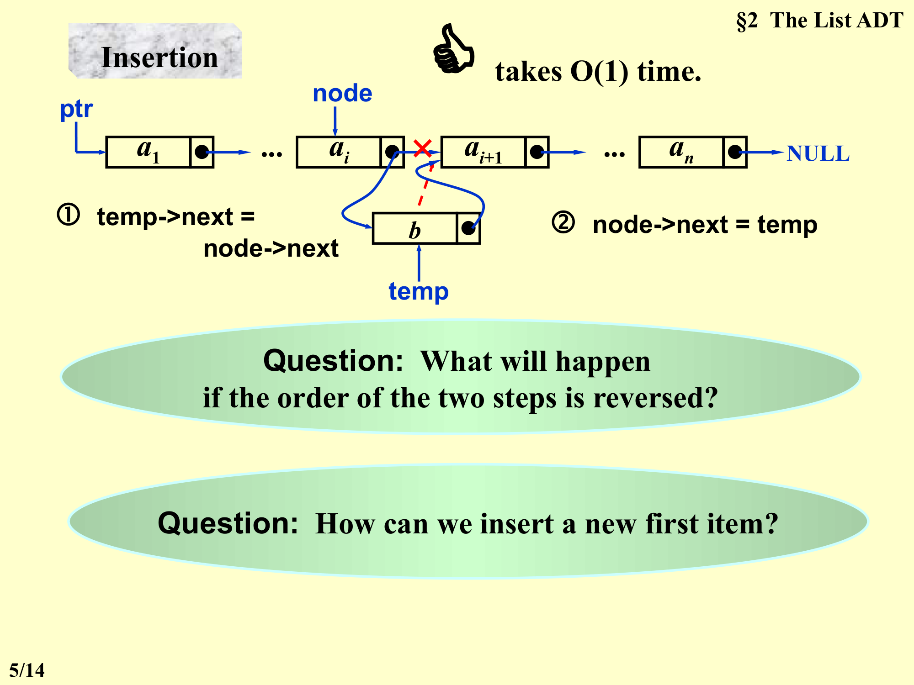

**步骤：**
```c
temp->next = node->next;  // 第1步：将 temp 指向 a_{i+1}
node->next = temp;        // 第2步：将 node 指向 temp
```

**思考题：**
- 如果将这两步的顺序颠倒，会发生什么？（答案：会丢失链表后续部分的链接 —— `node->next` 在 `temp->next` 设置之前被覆盖，导致链断裂。）
- 如何插入一个新的首元素？（答案：更新头指针 `ptr` 使其指向新节点。）

#### 删除 — $O(1)$ 时间

**图示说明：** 删除节点 `node`（包含 `b`）。我们需要 `pre` 指向 $a_i$（`node` 的前一个节点）。

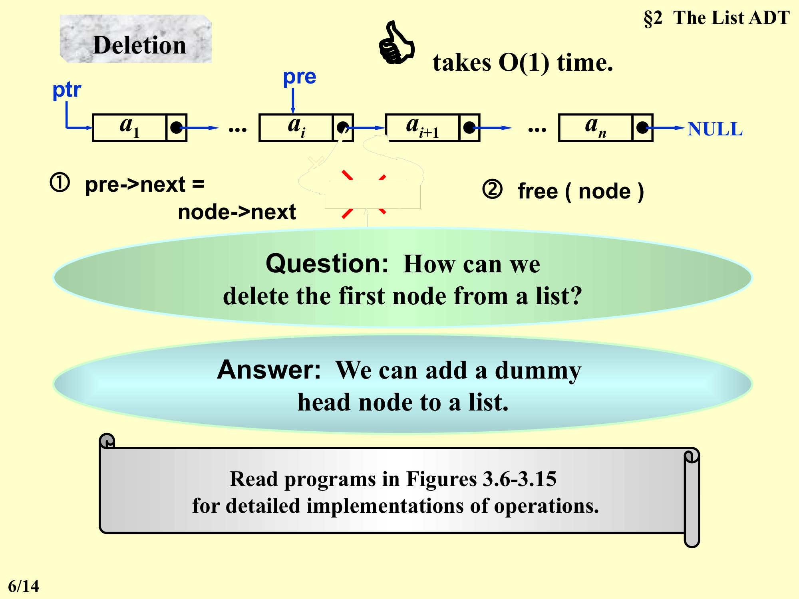

**步骤：**
```c
pre->next = node->next;  // 第1步：绕过该节点
free(node);              // 第2步：释放内存
```

**思考题：**
- 如何删除链表中的第一个节点？（答案：可以为链表添加一个**哑头节点 (Dummy Header Node)**，这样第一个真正的节点不直接由头指针指向。）

**参考资料：** 阅读图 3.6–3.15 中的程序，了解操作的详细实现。

---

### 双向循环链表 (Doubly Linked Circular List)

**为什么需要双向链表 (Doubly Linked List)？**
- 在**单向链表 (Singly Linked List)** 中，从给定节点查找前一个节点需要从头再次遍历 — $O(N)$。
- 如果要删除第 $m$ 个节点，需要知道它的**前驱节点 (Predecessor)**。使用单向链表必须再从第一个节点开始遍历。
- 使用双向链表可以向后遍历。

**节点结构：**
```c
typedef struct node *node_ptr;
typedef struct node {
    node_ptr llink;    // 指向前一个节点的指针 (Predecessor / Left Link)
    element   item;
    node_ptr rlink;    // 指向后一个节点的指针 (Successor / Right Link)
};
```

**性质：**
$$
\text{ptr} = \text{ptr}\to\text{llink}\to\text{rlink} = \text{ptr}\to\text{rlink}\to\text{llink}
$$
（这是正确连接的双向链表的不变性条件。）

**图示说明 — 带头节点的双向循环链表：**

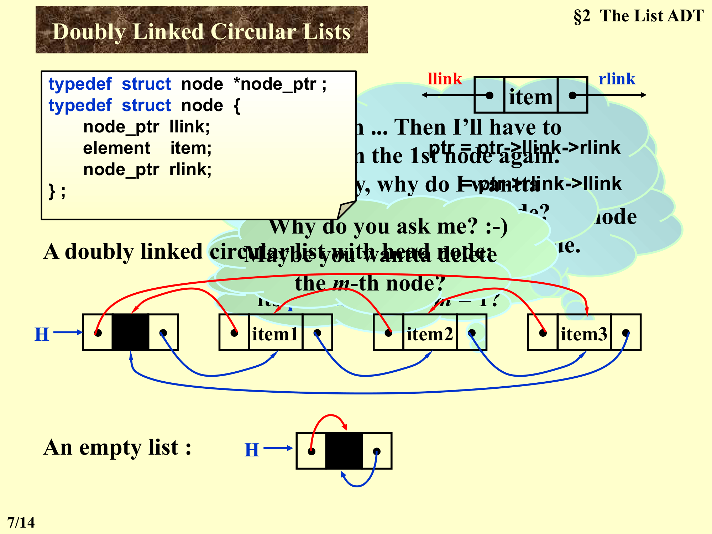

```
H <-> item1 <-> item2 <-> item3 <-> ... (循环，回到 H)
```
- `H` 是哑头节点。
- 每个节点有 `llink`（向左指）和 `rlink`（向右指）。
- 头节点的 `rlink` 指向 `item1`，`llink` 指向最后一个节点。
- 最后一个节点的 `rlink` 指回 `H`，`H` 的 `llink` 指向最后一个节点。

**空表 (Empty List)：**
```
H <-> H  (llink 和 rlink 都指向自身)
```

---

### 线性表的两个应用 (Two Applications of List)

#### (a) 多项式 ADT (Polynomial ADT)

**对象：**
$$
P(x) = a_1 x^{e_1} + \cdots + a_n x^{e_n}
$$
一组有序对 $\langle e_i, a_i \rangle$，其中 $a_i$ 是**系数 (Coefficient)**，$e_i$ 是**指数 (Exponent)**。$e_i$ 是**非负整数 (Non-negative Integer)**。

**操作：**
- 求多项式的**次数 (Degree)**，$\max\{e_i\}$。
- 两个多项式的**加法 (Addition)**。
- 两个多项式的**减法 (Subtraction)**。
- 两个多项式的**乘法 (Multiplication)**。
- 多项式的**微分 (Differentiation)**。

---

##### 表示法 1：系数数组 (Representation 1: Coefficient Array)

```c
typedef struct {
    int CoeffArray[MaxDegree + 1];
    int HighPower;
} *Polynomial;
```

- 每个指数用作数组的索引。
- **优点：** 大多数操作易于实现，如加法和乘法。
- **缺点：** 对于**稀疏多项式 (Sparse Polynomial)** 浪费空间。

**说明问题的例子：**
- $P_1(x) = 10x^{1000} + 5x^{14} + 1$
- $P_2(x) = 3x^{1990} - 2x^{1492} + 11x + 5$

数组至少需要 1991 的大小，但大多数条目为零，这非常浪费。

**两个多项式（次数分别为 $N_1$ 和 $N_2$）乘法的时间复杂度：**
$$
O(N_1 \times N_2)
$$

---

##### 表示法 2：链表 (Representation 2: Linked List)

**图示说明：** 每一项表示为一个节点，包含：

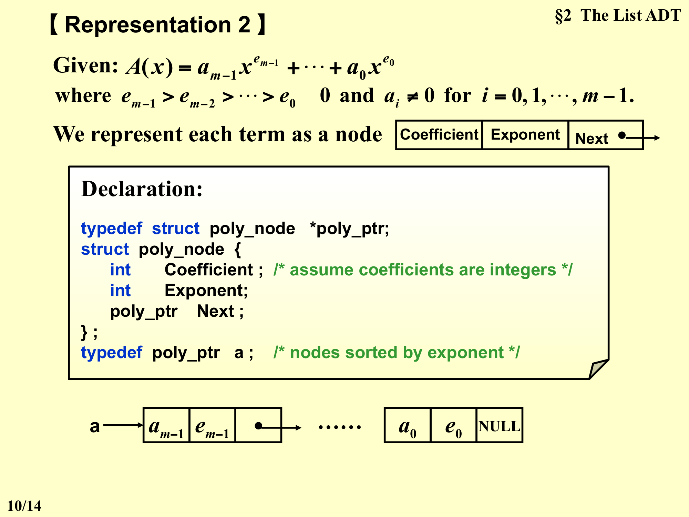

```
[系数 | 指数 | Next ->]
```

链表按指数降序排列。

**声明：**
```c
typedef struct poly_node *poly_ptr;
struct poly_node {
    int      Coefficient;  /* 假设系数为整数 */
    int      Exponent;
    poly_ptr Next;
};
typedef poly_ptr a;  /* 节点按指数排序 */
```

**图示说明：**
```
a -> [a_0 | e_0 | ->] [a_1 | e_1 | ->] ... [a_{m-1} | e_{m-1} | NULL]
```

---

#### (b) 多重表 (Multilist)

**示例：** 假设有 40,000 名学生和 2,500 门课程。请打印每门课程的学生名单，以及每位学生的注册课程列表。

##### 表示法 1：二维数组 (Representation 1: 2D Array)
```c
int Array[40000][2500];
```
- 这个数组**巨大**（40,000 $\times$ 2,500 = 1 亿个条目）。
- 大部分条目为空（每位学生只选少数几门课）。

##### 表示法 2：多重表（十字链表）(Multilist / Orthogonal List)

**图示说明：** 一种同时具有纵向和横向链接的链表结构：

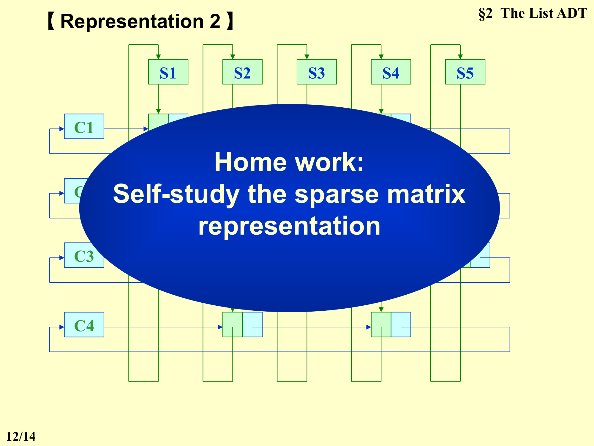

- 学生节点（S1, S2, S3, S4, S5）横向连接。
- 课程节点（C1, C2, C3, C4）纵向连接。
- 选课记录在两个方向上交叉链接。
- 这样可以高效遍历：对给定学生，沿着学生的链接查看所有课程；对给定课程，沿着课程的链接查看所有学生。

**作业：** 自学**稀疏矩阵 (Sparse Matrix)** 的表示。

---

### 3. 链表的游标实现 (Cursor Implementation)（无指针）

对于不支持指针的语言（如早期的 Pascal、BASIC），可以使用基于数组的游标实现来模拟链表。

**链表必须具备的特性：**
- 数据存储在一组结构体中。
- 每个结构体包含数据和指向下一个结构体的指针。
- 可以通过调用 `malloc` 从系统的全局内存获取新结构体，并通过调用 `free` 释放。

**游标空间 (Cursor Space)（全局结构体数组）：**
```
全局游标数组：
索引    元素    Next
0                  (**头结点 (Header Node)** / 空闲链表头)
1       ...       ...
2       ...       ...
...     ...       ...
S-1     ...       ...
```

**核心思想：**
- 使用结构体数组 `CursorSpace[]`，其中 `CursorSpace[i].Next` 充当"指针"（游标）。
- 索引 `0` 是**空闲链表 (Free List)**（可用节点链表）的头结点。
- `malloc` 的等价操作：从空闲链表取一个节点。
- `free` 的等价操作：将一个节点归还给空闲链表。

**malloc（等价操作）：**
```c
p = CursorSpace[0].Next;
CursorSpace[0].Next = CursorSpace[p].Next;
```

**free（等价操作）：**
```c
CursorSpace[p].Next = CursorSpace[0].Next;
CursorSpace[0].Next = p;
```

**图示说明：**

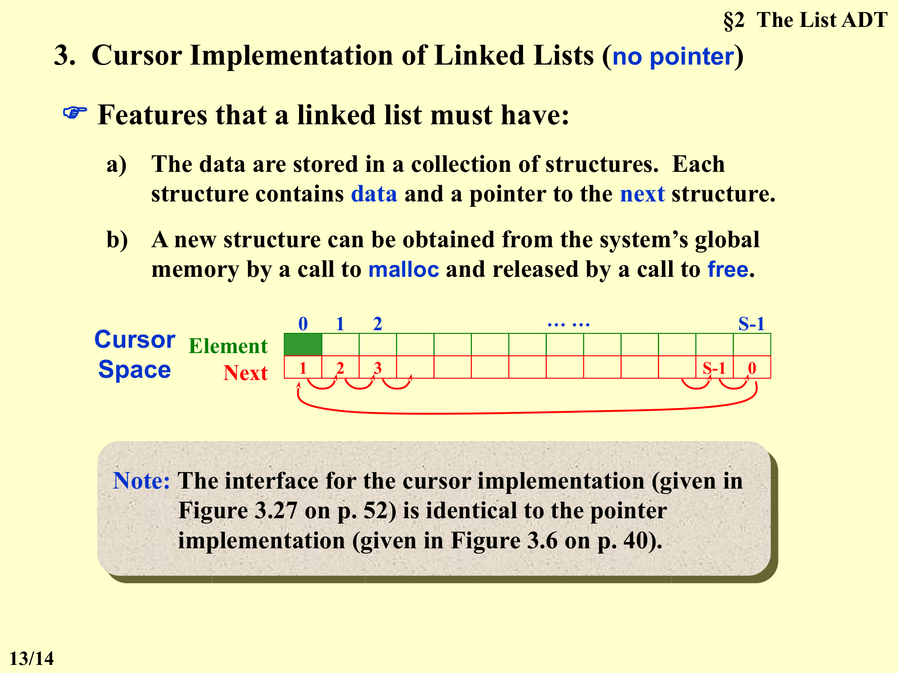

- `malloc` 前：索引 0 的 Next 指向第一个空闲节点（例如 2）。`malloc` 后：`p` 获得值 2，`CursorSpace[0].Next` 更新为 `CursorSpace[2].Next`（例如 5）。
- `free(p)` 前：将索引 `p` 处的节点归还给空闲链表，具体做法是将其 Next 指向 `CursorSpace[0].Next` 所指向的内容，然后将 `CursorSpace[0].Next` 更新为 `p`。

**注意：** 游标实现的接口（见图 3.27，第 52 页）与指针实现的接口（见图 3.6，第 40 页）**完全相同**。

**注意：** 游标实现通常**显著更快**，因为它省去了内存管理例程（没有系统调用 `malloc`/`free`）。

请阅读图 3.31–3.35 中给出的操作实现。

---

## §3 栈 ADT (Stack ADT)

### 1. ADT 规约 (ADT Specification)

**定义：** **栈 (Stack)** 是一种**后进先出 (LIFO, Last In First Out)** 线性表 —— 一种有序列表，其中插入和删除**仅在栈顶 (Top) 进行**。

**对象：** 包含零个或多个元素的有限有序列表。

**操作：**
```c
int IsEmpty(Stack S);
Stack CreateStack();
void DisposeStack(Stack S);
void MakeEmpty(Stack S);
void Push(ElementType X, Stack S);
ElementType Top(Stack S);
void Pop(Stack S);
```

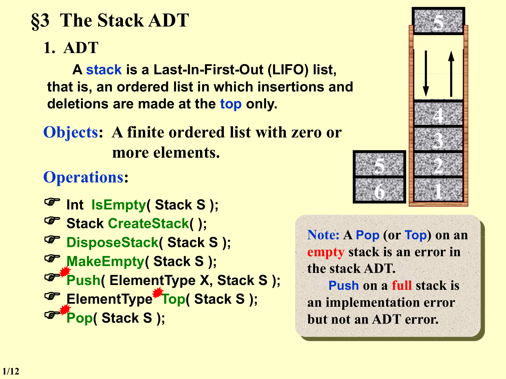

**栈操作的图示说明：**
- 元素被**压入 (Push)** 栈顶（例如，依次压入 1, 2, 3, 4, 5, 6）。
- **弹出 (Pop)** 时，最近压入的元素最先被移除（LIFO）。

**注意：**
- 对**空栈 (Empty Stack)** 执行 `Pop`（或 `Top`）是栈 ADT 中的**错误**。
- 对**满栈 (Full Stack)** 执行 `Push` 是**实现错误**，但**不是 ADT 错误**（ADT 不定义容量；这是实现细节）。

---

### 2. 实现 (Implementation)

#### (a) 链表实现（带头节点）(Linked Stack with Header Node)

**入栈 (Push)：**
```c
// 第1步：将新节点的 next 指向当前第一个单元
TmpCell->Next = S->Next;
// 第2步：将头节点指向新节点
S->Next = TmpCell;
```

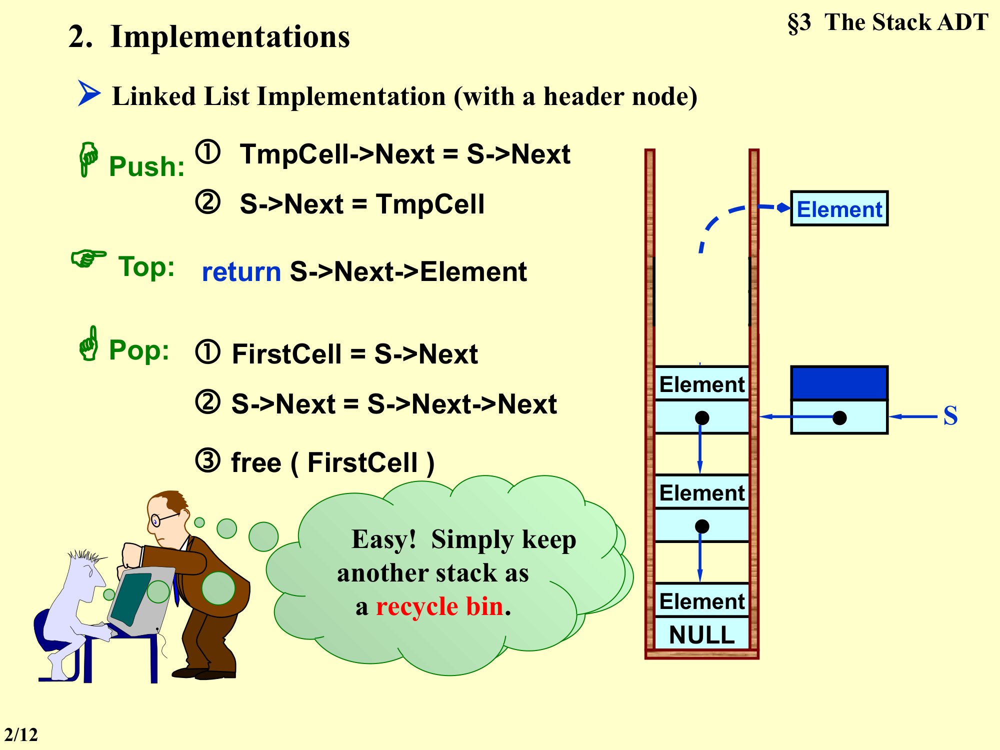

**图示说明：**
- `S` 是头节点（哑头）。
- `S->Next` 指向第一个真正的元素。
- 新节点 `TmpCell` 被插入到 `S` 之后。

**取栈顶 (Top)：**
```c
return S->Next->Element;
```

**出栈 (Pop)：**
```c
FirstCell = S->Next;          // 第1步：记住第一个单元
S->Next = S->Next->Next;      // 第2步：绕过它
free(FirstCell);              // 第3步：释放内存
```

**图示说明：**
- 移除第一个真正的元素（由 `S->Next` 指向）。
- `S->Next` 更新为指向下一个元素。

**问题：** 调用 `malloc` 和 `free` 代价较高。
- **解决方案：** 只需维护另一个栈作为**回收站**（一个预分配节点的池）。

---

#### (b) 数组实现 (Array Implementation of Stack)

```c
struct StackRecord {
    int Capacity;        /* 栈的大小 */
    int TopOfStack;      /* 栈顶指针 */
                         /* 入栈时 ++，出栈时 --，空栈为 -1 */
    ElementType *Array;  /* 存储栈元素的数组 */
};
```

**注意：**
1. 栈模型必须**良好封装 (Encapsulation)**。除了栈例程之外，代码的任何部分都不能直接访问 `Array` 或 `TopOfStack` 变量。
2. 在执行 `Push` 或 `Pop`/`Top` 之前必须进行**错误检查 (Error Checking)**。

**机制：**
- `TopOfStack` 初始为 `-1`（空栈）。
- `Push(X, S)`：先递增 `TopOfStack`，然后 `Array[TopOfStack] = X`。
- `Pop(S)`：递减 `TopOfStack`。
- `Top(S)`：返回 `Array[TopOfStack]`。

**参考资料：** 阅读图 3.38–3.52 中栈操作的详细实现。

---

### 3. 应用 (Applications)

#### (a) 符号平衡 (Symbol Balancing)

检查圆括号 `()`、方括号 `[]` 和花括号 `{}` 是否平衡。

**算法：**
```
创建一个空栈 S;
while (读入一个字符 c) {
    if (c 是**左括号 (Left Parenthesis / Left Bracket / Left Brace)**)
        Push(c, S);
    else if (c 是**右括号 (Right Parenthesis / Right Bracket / Right Brace)**) {
        if (S 为空) { 错误; 退出; }
        else {  /* 栈非空 */
            if (Top(S) 与 c 不匹配) { 错误; 退出; }
            else Pop(S);
        }
    }
}
if (S 不为空) 错误;
```

**复杂度：** $T(N) = O(N)$，其中 $N$ 是表达式的长度。

**这是一个在线算法 (Online Algorithm)** —— 它边读入输入边处理，无需向前查看。

---

#### (b) 后缀表达式求值 (Postfix Evaluation)（逆波兰表示法）

**示例 — 中缀表达式 (Infix Expression)：**
$$
a + b \times c - d / e
$$

**前缀表达式 (Prefix Expression)：**
$$
- + a \times b c / d e
$$

**后缀表达式 (Postfix Expression)：**
$$
a \; b \; c \times + \; d \; e / -
$$

- 在后缀表达式中，**优先级最高**的**运算符 (Operator)** 最先被求值。
- **逆波兰表示法 (Reverse Polish Notation, RPN)：** 运算符 (Operator) 跟在**操作数 (Operand)** 之后。

**示例 — 后缀表达式求值：** $6 \; 2 / \; 3 - \; 4 \; 2 \times + = ?$

**逐步求值过程：**

| 步骤 | 记号 | 栈（顶部向右） | 操作 |
|------|------|--------------|------|
| 1 | 6 | 6 | 压入操作数 |
| 2 | 2 | 6, 2 | 压入操作数 |
| 3 | / | 3 | 弹出 2，弹出 6，计算 $6/2=3$，压入结果 |
| 4 | 3 | 3, 3 | 压入操作数 |
| 5 | - | 0 | 弹出 3，弹出 3，计算 $3-3=0$，压入结果 |
| 6 | 4 | 0, 4 | 压入操作数 |
| 7 | 2 | 0, 4, 2 | 压入操作数 |
| 8 | * | 0, 8 | 弹出 2，弹出 4，计算 $4 \times 2 = 8$，压入结果 |
| 9 | + | 8 | 弹出 8，弹出 0，计算 $0+8=8$，压入结果 |

**结果：** $8$

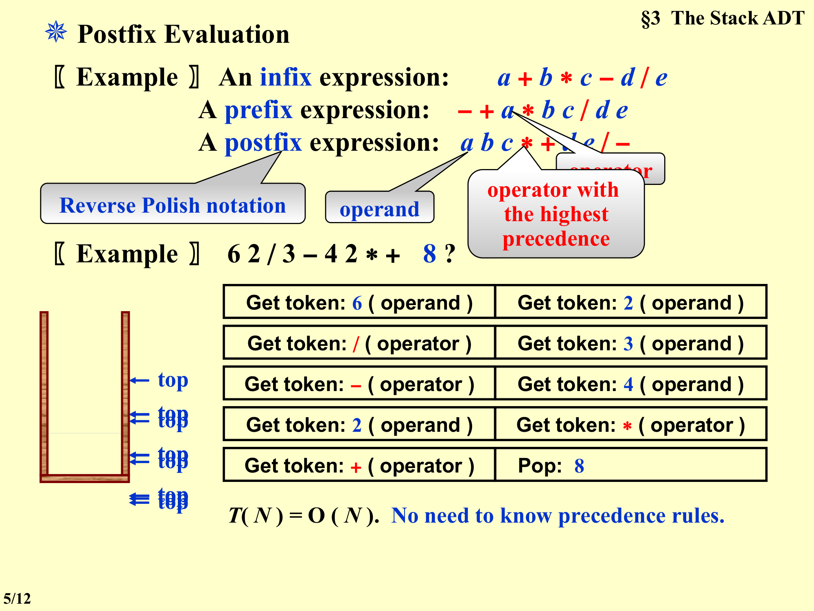

**后缀表达式求值算法：**
```
Stack s;
while (读入一个记号 t) {
    if (t 是操作数)
        Push(t, s);
    else {  /* t 是运算符 */
        op2 = Pop(s);
        op1 = Pop(s);
        result = op1 t op2;  // 例如 op1 + op2, op1 * op2 等
        Push(result, s);
    }
}
FinalResult = Pop(s);
```

**复杂度：** $T(N) = O(N)$。**无需知道优先级规则**（优先级已编码在后缀顺序中）。

---

#### (c) 中缀转后缀 (Infix to Postfix)

**示例 1：** $a + b \times c - d = \; ?$

**结果：** $a \; b \; c \times + \; d -$

**逐步算法演示：**

| 记号 | 输出 | 栈（顶部向右） | 说明 |
|------|------|--------------|------|
| a | a | | 操作数：直接输出 |
| + | a | + | 运算符：压入栈 |
| b | a b | + | 操作数：直接输出 |
| * | a b | +, * | 运算符：* 优先级高于 +，压栈 |
| c | a b c | +, * | 操作数：直接输出 |
| - | a b c * + | - | 运算符：* >= -？弹出 *；+ >= -？弹出 +；然后压入 - |
| d | a b c * + d | - | 操作数：直接输出 |
| 结束 | a b c * + d - | | 弹出剩余运算符 |

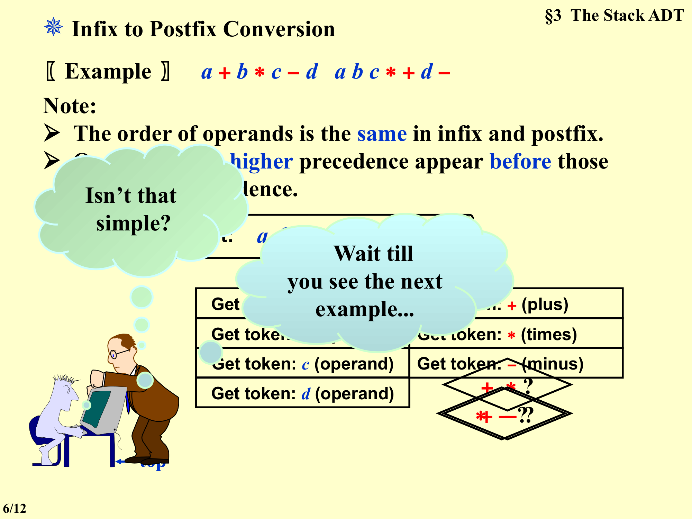

**关键观察：**
- **操作数的顺序**在中缀和后缀中相同。
- 在后缀表达式中，**优先级高的运算符出现在优先级低的运算符之前**。

**示例 2：** $a \times (b + c) / d = \; ?$

**结果：** $a \; b \; c + \times \; d /$

**逐步算法演示：**

| 记号 | 输出 | 栈（顶部向右） | 说明 |
|------|------|--------------|------|
| a | a | | 操作数：输出 |
| * | a | * | 运算符：压栈 |
| ( | a | *, ( | 左括号：压栈（最高进入优先级） |
| b | a b | *, ( | 操作数：输出 |
| + | a b | *, (, + | 运算符：与 ( 比较；( 的栈内优先级较低，所以压入 + |
| c | a b c | *, (, + | 操作数：输出 |
| ) | a b c + | * | 右括号：弹出并输出直到遇到匹配的 (；弹出 +，然后弹出 ( |
| / | a b c + * | / | 运算符：* >= /？是，弹出 *；然后压入 / |
| d | a b c + * d | / | 操作数：输出 |
| 结束 | a b c + * d / | | 弹出剩余运算符 |

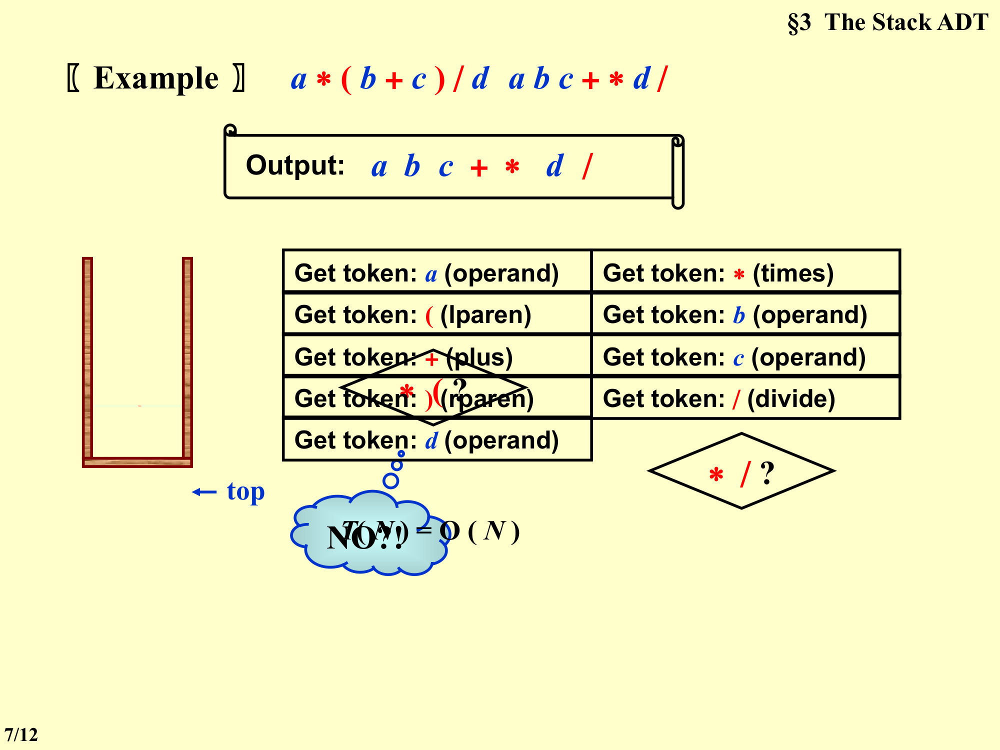

**复杂度：** $T(N) = O(N)$

**处理括号的重要规则：**
1. **除非在处理 `)` ，否则永远不要从栈中弹出 `(`**。
2. 当 `(` **不在**栈中时，它的优先级是**最高的**。但当它**在**栈中时，它的优先级是**最低的**。
   - 为符号定义**栈内优先级 (ISP, In-Stack Priority)** 和 **进入优先级 (ICP, Incoming Priority)**。
   - 每次使用相应的优先级进行比较。

**优先级表（典型）：**

| 符号 | 进入优先级 (ICP) | 栈内优先级 (ISP) |
|------|-----------------|-----------------|
| `(` | 最高 | 最低 |
| `+`, `-` | 1 | 1 |
| `*`, `/` | 2 | 2 |
| `^`（乘方, Exponentiation） | 3（右结合, Right-associative） | 3 |

**特殊情况 — 乘方：**
- $a - b - c$ 会被转换为 $a \; b - c -$（左结合, Left-associative）。
- 然而，$2^{2^3}$ 必须转换为 $2 \; 2 \; 3 \; \hat{} \; \hat{}$，而不是 $2 \; 2 \; \hat{} \; 3 \; \hat{}$，因为乘方是**从右到左结合 (Right-to-left Associative)** 的。

---

#### (d) 函数调用 (Function Calls)（系统栈 / 运行时栈）

**概念：**
- 当函数被调用时，一个**栈帧 (Stack Frame)**（**活动记录 (Activation Record)**）被压入系统栈。
- 栈帧包含：
  - **旧帧指针 (Old Frame Pointer)**（前一个基址指针）
  - **返回地址 (Return Address)**（函数返回后继续执行的位置）
  - **局部变量 (Local Variables)**（函数局部数据的存储空间）
- 当函数返回时，该帧被弹出，控制权回到保存的返回地址。

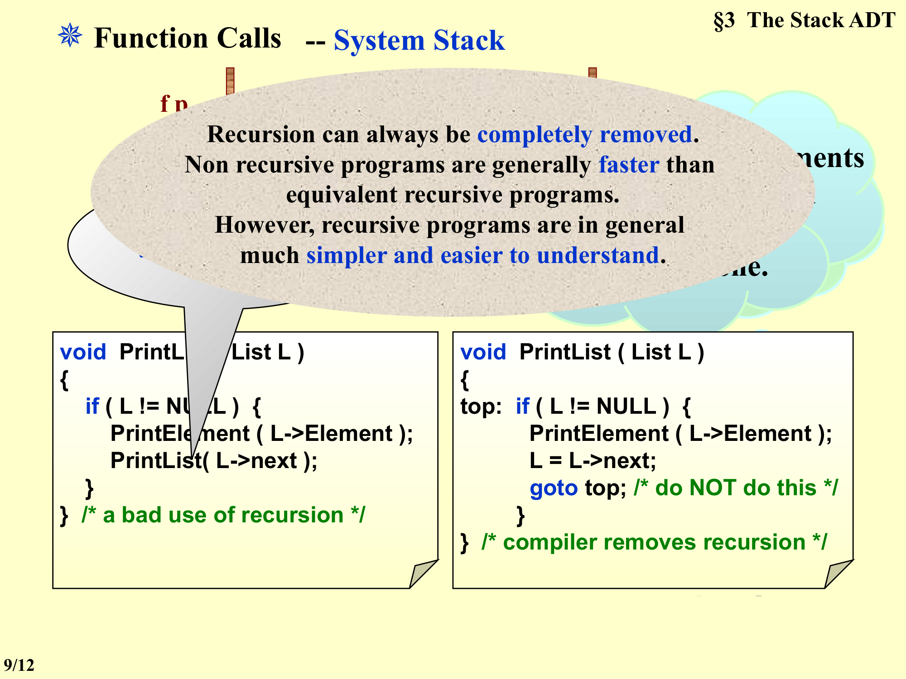

**递归 (Recursion)：**
- 递归**总是**可以被完全消除（转化为**迭代 (Iteration)**）。
- **非递归 (Non-recursive) 程序通常比等价的递归程序更快。**
- **然而，递归程序通常更简单、更容易理解。**

**尾递归 (Tail Recursion)：**
- 一种特殊的递归形式，其中递归调用是函数中的**最后一个操作**。
- 编译器可以轻松**消除尾递归 (Tail Recursion Elimination)**。

**示例 — 递归的糟糕使用（尾递归）：**
```c
void PrintList(List L)
{
    if (L != NULL) {
        PrintElement(L->Element);
        PrintList(L->next);
    }
}  /* 尾递归的不良使用 */
```
这是一个尾递归。对于包含 100 万个元素的链表，会导致**栈溢出 (Stack Overflow)**，因为每次调用都会消耗一个栈帧。

**编译器消除后的版本（迭代）：**
```c
void PrintList(List L)
{
top:
    if (L != NULL) {
        PrintElement(L->Element);
        L = L->next;
        goto top;  /* 在实际代码中不要这么做 — 请使用循环 */
    }
}  /* 编译器消除了递归 */
```

**重要提示：** "如果 100 万个元素不足以让程序崩溃，试试更大的数。" —— 请小心深层递归；栈空间是有限的。

---

## §4 队列 ADT (Queue ADT)

### 1. ADT 规约 (ADT Specification)

**定义：** **队列 (Queue)** 是一种**先进先出 (FIFO, First In First Out)** 线性表 —— 一种有序列表，其中**插入在一端（队尾, Rear）进行**，**删除在另一端（队首, Front）进行**。

**对象：** 包含零个或多个元素的有限有序列表。

**操作：**
```c
int IsEmpty(Queue Q);
Queue CreateQueue();
void DisposeQueue(Queue Q);
void MakeEmpty(Queue Q);
void Enqueue(ElementType X, Queue Q);  // 入队 (Enqueue)：在队尾 (Rear) 插入
ElementType Front(Queue Q);            // 查看队首 (Front) 元素
void Dequeue(Queue Q);                 // 出队 (Dequeue)：移除队首 (Front) 元素
```

**图示说明：**
- 元素从队尾进入，从队首离开。
- 就像现实生活中的队列（排队）：排在前面的人先被服务。

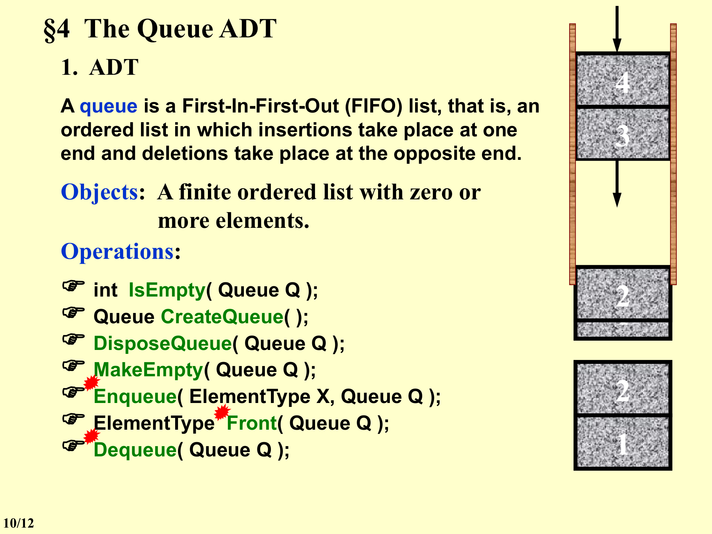

---

### 2. 队列的数组实现 (Array Implementation of Queue)

> **注意：** 链表实现很简单（类似于**链式栈 (Linked Stack)**，但需要同时维护**头指针 (Head Pointer)** 和 **尾指针 (Tail Pointer)**）。

**QueueRecord 结构：**
```c
struct QueueRecord {
    int Capacity;     /* 队列的最大容量 (Queue Capacity) */
    int Front;        /* 队首指针 (Front Pointer) */
    int Rear;         /* 队尾指针 (Rear Pointer) */
    int Size;         /* 可选的 — 队列当前大小 (Current Size) */
    ElementType *Array;  /* 存储队列元素的数组 (Element Array) */
};
```

**示例 — 操作系统中的作业调度：**

**逐步队列操作图示说明：**
1. **入队作业 1：** Front=0, Rear=0, `Array[0] = Job1`
2. **入队作业 2：** Front=0, Rear=1, `Array[1] = Job2`
3. **入队作业 3：** Front=0, Rear=2, `Array[2] = Job3`
4. **出队作业 1：** Front=1（向前移动），Rear=2
5. **入队作业 4：** Front=1, Rear=3, `Array[3] = Job4`
6. **入队作业 5：** Front=1, Rear=4, `Array[4] = Job5`
7. **入队作业 6：** Front=1, Rear=5, `Array[5] = Job6`
8. **出队作业 2：** Front=2, Rear=5
9. **入队作业 7：** Front=2, Rear=6, `Array[6] = Job7`
10. **入队作业 8：** Front=2, Rear=7 — 但如果 Capacity=8，Rear 现在等于 Capacity，需要**回绕 (Wrap-around)**！

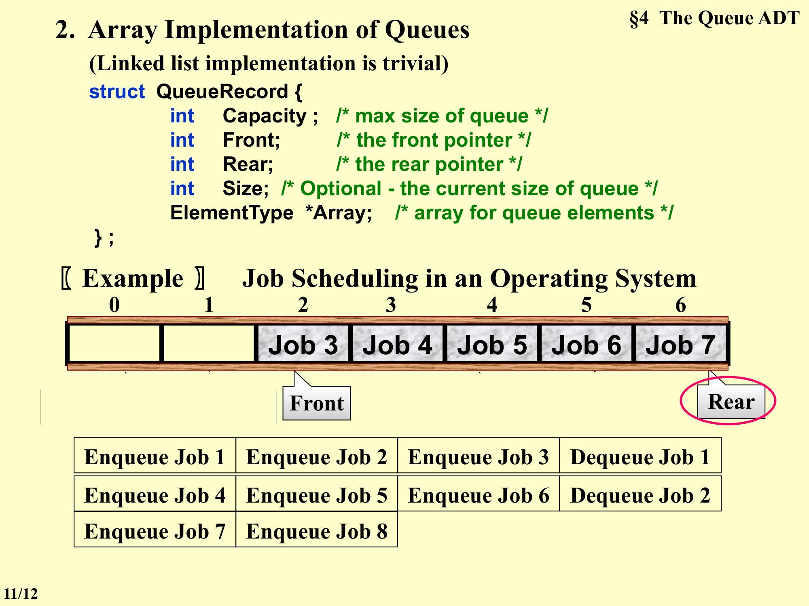

---

### 循环队列 (Circular Queue)

为了避免 Front 前移后 Front 之前的空间被浪费，队列被实现为**循环数组 (Circular Array)**。

**图示说明：**

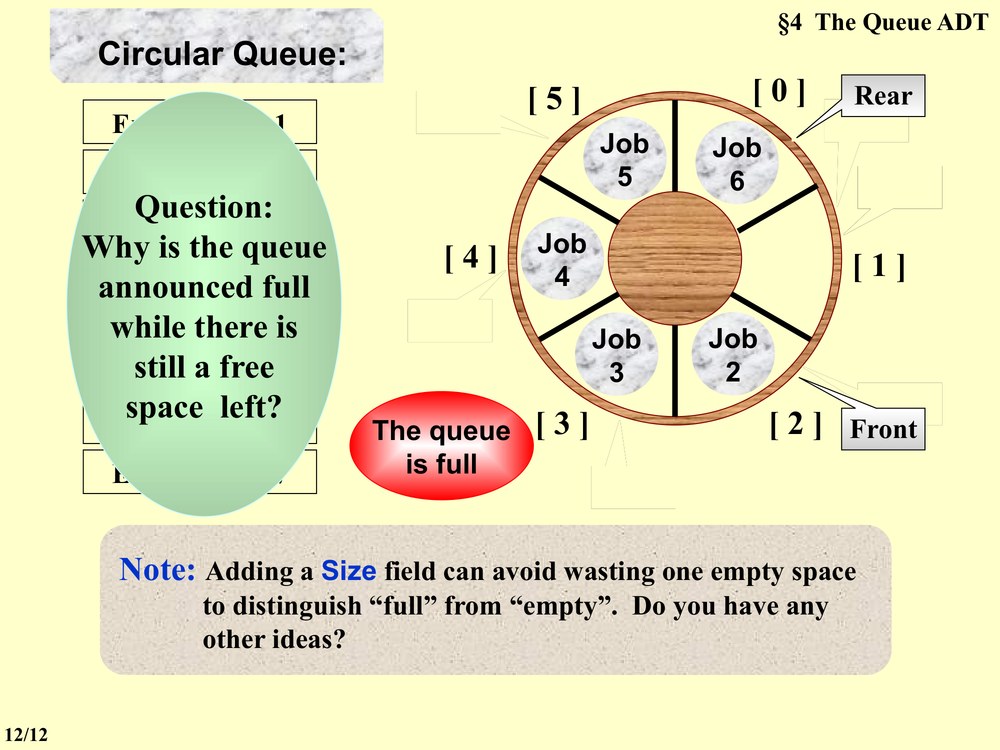

```
循环数组，索引 [0], [1], [2], [3], [4], [5]
- 初始状态：Rear 和 Front 都在 [0]（空队列）
- 入队作业 1 后：Rear 移到 [1]，Front 在 [0]
- 入队作业 2、作业 3 后：Rear 移到 [2]，然后 [3]
- 出队作业 1 后：Front 移到 [1]
- 入队作业 4、作业 5 后：需要时 Rear 会**回绕 (Wrap-around)**
- 当 Rear 从后方追上 Front 时，队列为满
```

**循环队列的关键操作：**
- `Enqueue`：`Rear = (Rear + 1) % Capacity; Array[Rear] = X;`
- `Dequeue`：`Front = (Front + 1) % Capacity;`
- **空队 (Empty)** 条件：`Front == Rear`
- **满队 (Full)** 条件：`(Rear + 1) % Capacity == Front`（留出一个空位以区分满和空）

**问题：** 为什么明明还剩一个空闲空间，却宣布队列已满？
- **答案：** 为了区分"满"和"空"。在循环队列中，`Front == Rear` 表示空。如果填满所有插槽，那么 `Front == Rear` 也可能表示满——这就产生了歧义。因此我们牺牲一个插槽来区分这两种状态。

**如何避免浪费那一个空间？**
- 在结构中添加一个 **`Size` 字段**来跟踪当前元素数量。有了 `Size`，`Front == Rear` 且 `Size == 0` 表示空，`Front == Rear` 且 `Size == Capacity` 表示满——无需浪费插槽。
- **其他思路：** 使用一个标志位来指示最后一次操作是入队还是出队。

---

### 附加问题（来自课件）

**LRU-K**（2 分）
- 截止日期：2026 年 6 月 16 日（星期二）晚上 10:00
- 该问题可在以下网址查找和提交：https://pintia.cn/

---

## 时间复杂度总结 (Time Complexity Summary)

| 操作 | 数组线性表 | 链表 | 数组栈 | 链式栈 | 数组队列（循环） | 链式队列 |
|------|-----------|------|--------|--------|----------------|---------|
| 查找第 K 个 | $O(1)$ | $O(N)$ | 不适用 | 不适用 | 不适用 | 不适用 |
| 插入 | $O(N)$ | $O(1)$（给定位置） | $O(1)$（Push） | $O(1)$（Push） | $O(1)$（Enqueue） | $O(1)$（Enqueue） |
| 删除 | $O(N)$ | $O(1)$（给定位置） | $O(1)$（Pop） | $O(1)$（Pop） | $O(1)$（Dequeue） | $O(1)$（Dequeue） |

## 关键术语 (Key Terminology)

| 术语 | 定义 |
|------|------|
| **ADT** | 抽象数据类型 —— 将规约与实现分离 |
| **线性表 (List)** | 元素的有序集合 |
| **顺序映射 (Sequential mapping)** | 基于数组的存储方式，元素 $i$ 位于位置 `base + i` |
| **链表 (Linked List)** | 节点通过指针连接，大小动态可变 |
| **双向循环链表 (Doubly Linked Circular List)** | 每个节点有前驱/后继指针；最后一个节点指回头节点 |
| **游标实现 (Cursor Implementation)** | 基于数组的链表模拟，使用索引代替指针 |
| **栈 (Stack)** | LIFO 结构 —— 仅在栈顶进行插入/删除 |
| **入栈 (Push)** | 插入到栈中 |
| **出栈 (Pop)** | 从栈中移除 |
| **取栈顶 (Top)** | 查看栈顶元素 |
| **队列 (Queue)** | FIFO 结构 —— 从队尾插入，从队首删除 |
| **入队 (Enqueue)** | 插入到队列 |
| **出队 (Dequeue)** | 从队列移除 |
| **队首 (Front)** | 查看队首元素 |
| **循环队列 (Circular Queue)** | 基于数组的队列，通过回绕来重用空间 |
| **尾递归 (Tail Recursion)** | 递归调用是最后一个操作的递归形式 |
| **后缀/逆波兰 (Postfix/Reverse Polish)** | 操作符跟在操作数之后 —— 无需优先级规则 |
| **前缀 (Prefix)** | 操作符位于操作数之前 |
| **中缀 (Infix)** | 操作符位于操作数之间（正常记法） |
