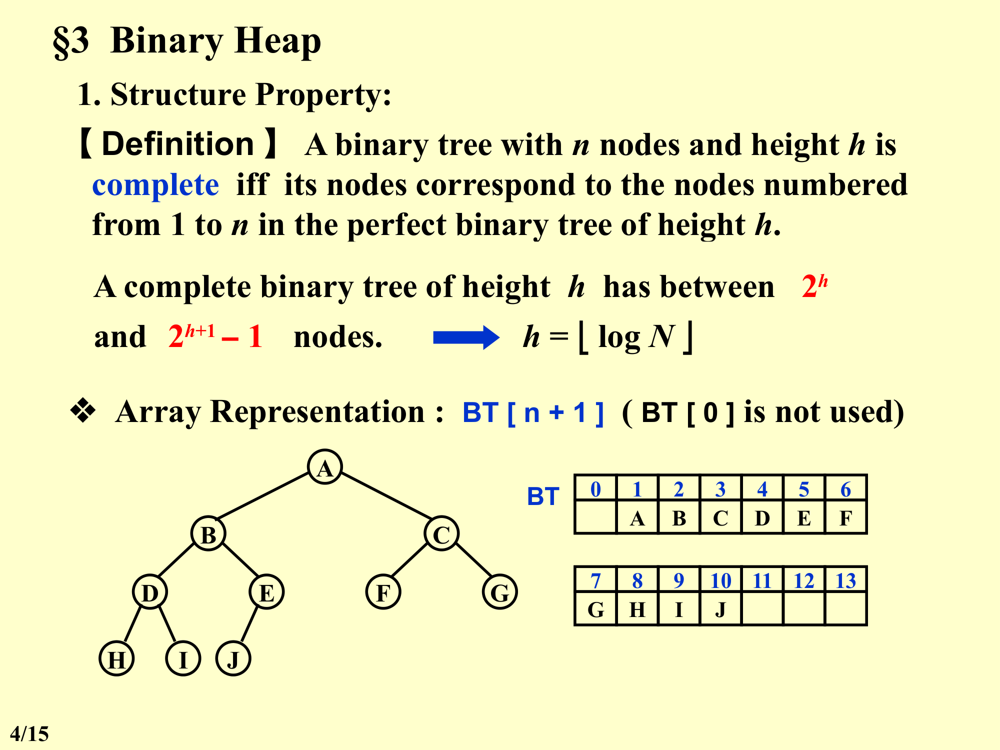
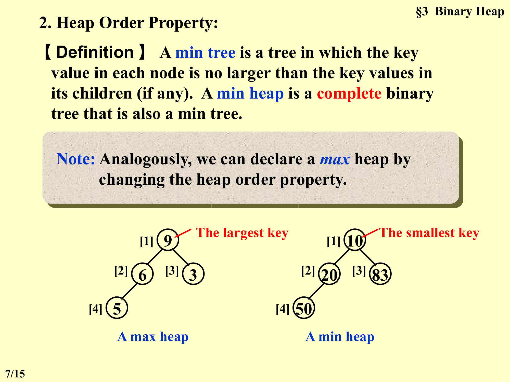
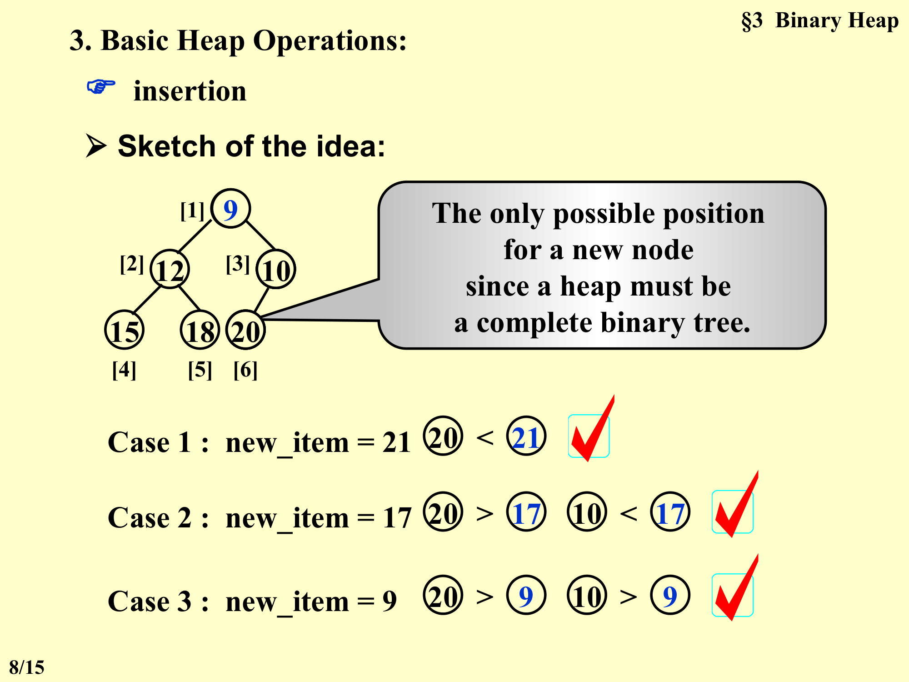
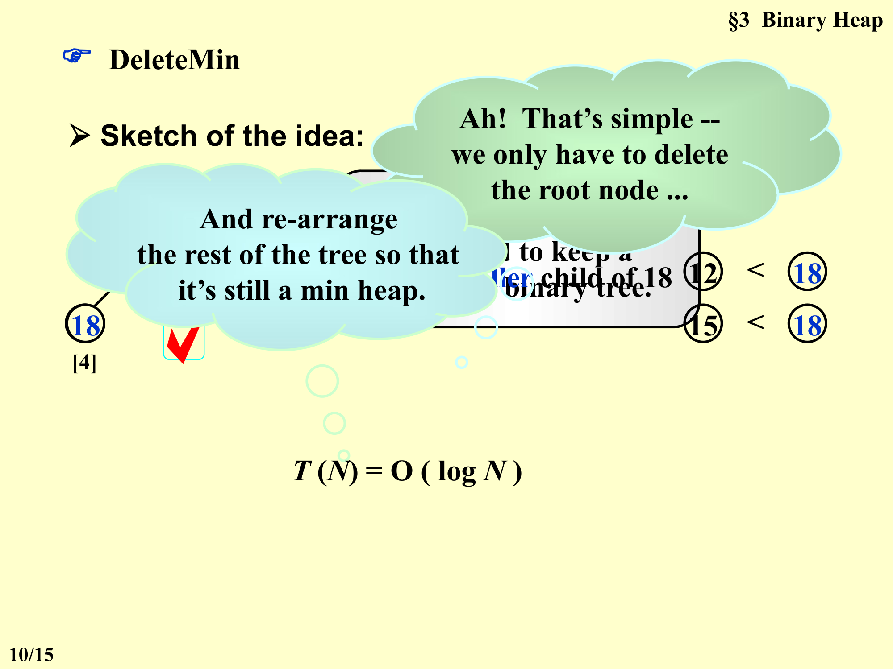
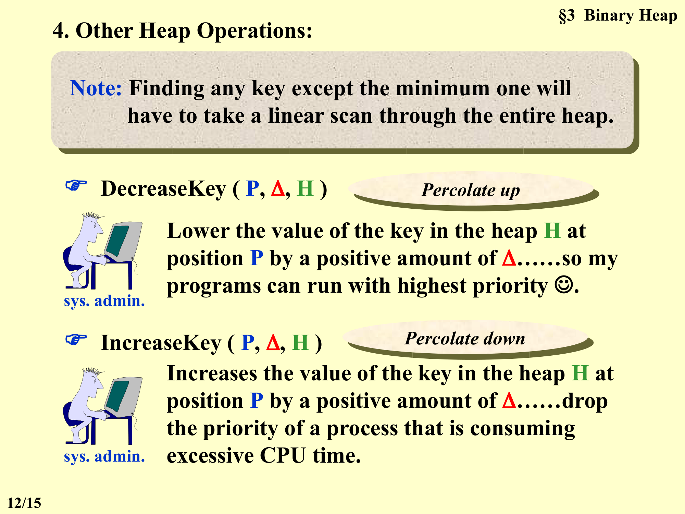
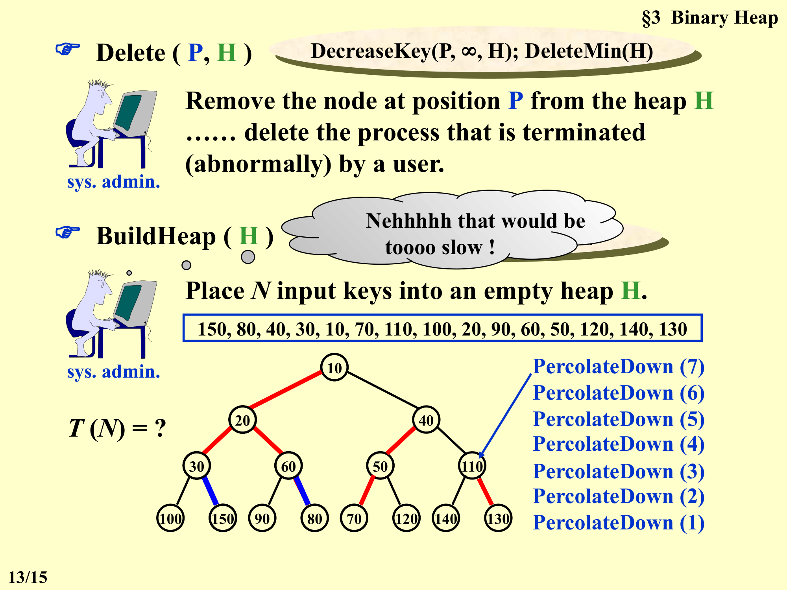
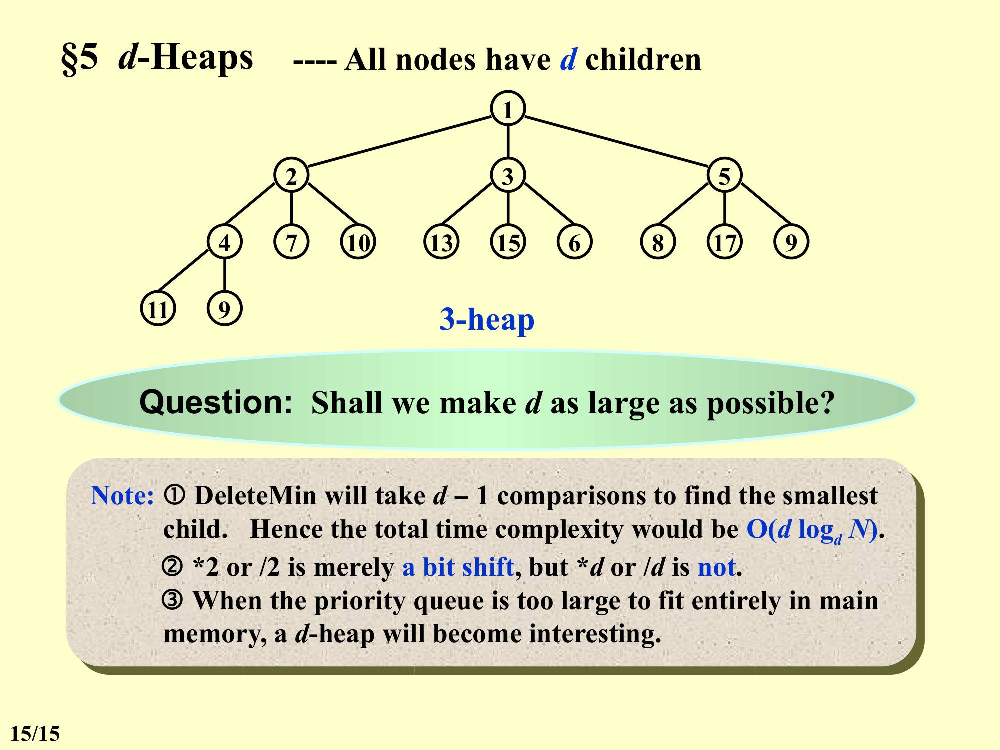

# 第5章：优先队列 (Chapter 5: Priority Queues)

## 目录（Table of Contents）

- [§1 ADT 模型](#1-adt-模型)
- [§2 简单实现](#2-简单实现)
- [§3 二叉堆](#3-二叉堆)
  - [3.1 结构性质](#31-结构性质)
  - [3.2 堆序性质](#32-堆序性质)
  - [3.3 堆的基本操作](#33-堆的基本操作)
  - [3.4 其他堆操作](#34-其他堆操作)
- [§4 优先队列的应用](#4-优先队列的应用)
- [§5 d-堆](#5-d-堆)

---

## §1 ADT 模型（ADT Model）

优先队列（Priority Queue）是一种特殊的队列，其核心特点是**删除具有最高或最低优先级的元素**。

### 对象（Objects）

一个包含零个或多个元素的有序有限列表。

### 操作（Operations）

| 操作 | 函数签名 | 描述 |
|-----------|-----------|-------------|
| `Initialize` | `PriorityQueue Initialize(int MaxElements)` | 创建一个最大容量为 `MaxElements` 的空优先队列 |
| `Insert` | `void Insert(ElementType X, PriorityQueue H)` | 向优先队列 H 中插入元素 X |
| `DeleteMin` | `ElementType DeleteMin(PriorityQueue H)` | 删除并返回优先队列 H 中优先级最小的元素 |
| `FindMin` | `ElementType FindMin(PriorityQueue H)` | 返回优先队列 H 中优先级最小的元素（不删除） |

---

## §2 简单实现（Simple Implementations）

以下几种简单实现方案各有优劣，核心权衡在于插入（Insertion）和删除（Deletion）操作的时间复杂度。

### 无序数组（Array）

| 操作 | 时间复杂度 | 描述 |
|-----------|-----------------|-------------|
| 插入 | $\Theta(1)$ | 在数组末尾添加一个元素 |
| 删除（查找） | $\Theta(n)$ | 查找最大/最小关键字 |
| 删除（移除） | $O(n)$ | 删除该元素并移动数组填补空缺 |

### 无序链表（Linked List）

| 操作 | 时间复杂度 | 描述 |
|-----------|-----------------|-------------|
| 插入 | $\Theta(1)$ | 添加到链表的头部 |
| 删除（查找） | $\Theta(n)$ | 查找最大/最小关键字 |
| 删除（移除） | $\Theta(1)$ | 删除该元素（找到后直接移除节点） |

### 有序数组（Ordered Array）

| 操作 | 时间复杂度 | 描述 |
|-----------|-----------------|-------------|
| 插入（查找） | $O(n)$ | 查找合适的插入位置 |
| 插入（移动） | $O(n)$ | 移动数组元素并插入新元素 |
| 删除 | $\Theta(1)$ | 直接删除第一个或最后一个元素 |

> **优势**：由于删除操作的次数通常不会超过插入操作，有序数组在整体上可能更优。

### 有序链表（Ordered Linked List）

| 操作 | 时间复杂度 | 描述 |
|-----------|-----------------|-------------|
| 插入（查找） | $O(n)$ | 查找合适的插入位置 |
| 插入（添加） | $\Theta(1)$ | 直接插入元素（找到位置后） |
| 删除 | $\Theta(1)$ | 直接删除第一个或最后一个元素 |

### 二叉搜索树（Binary Search Tree）

使用平衡树（如 AVL 树）可以实现**插入和删除均为 $O(\log N)$**。

**讨论要点**：
- AVL 树的很多操作对优先队列来说是不必要的
- 指针操作总是有风险
- 插入是随机的，但删除并非随机——我们只需要删除最小元素
- 如果保持平衡树，插入和删除都只需要 $O(\log N)$
- 但是，对于优先队列来说，**二叉堆（Binary Heap）** 提供了更好的选择

---

## §3 二叉堆（Binary Heap）

### 3.1 结构性质（Structure Property）

#### 完全二叉树（Complete Binary Tree）

**【定义】** A binary tree with $n$ nodes and height $h$ is **complete** iff its nodes correspond to the nodes numbered from 1 to $n$ in the perfect binary tree of height $h$.

（一棵具有 $n$ 个节点、高度为 $h$ 的二叉树是**完全**的，当且仅当其节点与高度为 $h$ 的完美二叉树中编号从 1 到 $n$ 的节点一一对应。）

**完全二叉树的节点数范围**：

$$2^h \leq \text{number of nodes} \leq 2^{h+1} - 1$$

**高度关系**：

$$h = \lfloor \log N \rfloor$$

**完全二叉树的编号示意**（高度 h 的完美二叉树编号）：

```
        1
       / \
      2   3
     / \ / \
    4  5 6  7
   / \ /\ /\ /\
  8  9 10 11 12 13 14 15
```



#### 数组表示（Array Representation）

完全二叉树可以使用数组高效存储。使用 `BT[n+1]`（`BT[0]` 不使用）。

**图示说明**：

一棵完全二叉树的结构如下（节点用字母表示）：
```
        A
       / \
      B   C
     / \ / \
    D  E F  G
   / \
  H   I
        \
         J
```

对应的数组表示为：

| Index | 0 | 1 | 2 | 3 | 4 | 5 | 6 | 7 | 8 | 9 | 10 | 11 | 12 | 13 |
|-------|---|---|---|---|---|---|---|---|---|---|---|---|---|---|
| Value | - | A | B | C | D | E | F | G | H | I | J |   |   |   |

> 注：`BT[0]` 未使用（可存放**哨兵（Sentinel）**）。

#### 索引关系引理（Index Relation Lemma）

**【引理】** 如果一棵有 $n$ 个节点的完全二叉树使用顺序存储表示，则对于任意索引为 $i$ 的节点，$1 \leq i \leq n$，有：

- **父节点**：$\text{PARENT}(i) = \lfloor i / 2 \rfloor$
- **左子节点**：$\text{LEFT_CHILD}(i) = 2i$
- **右子节点**：$\text{RIGHT_CHILD}(i) = 2i + 1$

#### 初始化代码（Initialize Code）

```c
PriorityQueue Initialize(int MaxElements)
{
    PriorityQueue H;
    if (MaxElements < MinPQSize)
        return Error("Priority queue size is too small");
    H = malloc(sizeof(struct HeapStruct));
    if (H == NULL)
        return FatalError("Out of space!!!");
    /* Allocate the array plus one extra for sentinel */
    H->Elements = malloc((MaxElements + 1) * sizeof(ElementType));
    if (H->Elements == NULL)
        return FatalError("Out of space!!!");
    H->Capacity = MaxElements;
    H->Size = 0;
    H->Elements[0] = MinData;  /* set the sentinel */
    return H;
}
```

**关键要点**：
- 分配 `MaxElements + 1` 的空间（因为索引 0 不使用或用作哨兵）
- `H->Elements[0]` 被设置为 `MinData`（哨兵），其值不大于**堆（Heap）** 中最小元素
- `H->Size` 初始化为 0

---

### 3.2 堆序性质（Heap Order Property）

#### 最小堆（Min Heap）

**【定义】** A **min tree** is a tree in which the key value in each node is **no larger than** the key values in its children (if any). A **min heap** is a complete binary tree that is also a min tree.

（最小树（min tree）是一棵每个节点中的键值都不大于其子节点键值的树。最小堆（min heap）是一个同时也是最小树的完全二叉树。）

#### 最大堆（Max Heap）

类似地，可以通过改变堆序性质来定义**最大堆**：每个节点的键值不小于其子节点的键值。

#### 堆结构图示（Heap Structure Illustration）

**最小堆**：
```
      3                      (最小键在根)
     / \
    6   5
   / \
  9   10
```

**最大堆**：
```
      83                     (最大键在根)
     / \
    20  50
   / \
    10  5
```



---

### 3.3 堆的基本操作（Basic Heap Operations）

### 3.3 堆的基本操作（Basic Heap Operations）

#### 插入（Insert）——上滤（Percolate Up）

**核心思路**：
由于堆必须保持完全二叉树的性质，新节点的唯一可能位置是当前完全二叉树的**最后一个位置**（即数组的 `Size + 1` 处）。

**算法步骤**：
1. 在数组末尾（`++H->Size` 处）创建一个空穴（hole）
2. 将新元素与父节点比较
3. 如果新元素小于父节点，将父节点下移（移入空穴），空穴上移
4. 重复步骤 2-3 直到找到合适的位置（新元素不小于父节点时停止）
5. 将新元素放入空穴

**三种情况示例**（初始堆）：

```
        10
       /  \
      12   20
     /  \
    15  18
```



- **Case 1**：插入 `21` — 21 与父节点 20 比较，20 < 21，直接放在末尾（无需上滤）
- **Case 2**：插入 `17` — 17 < 20（上滤一层），然后 17 与父节点 10 比较，10 < 17，停止
- **Case 3**：插入 `9` — 9 < 20（上滤），9 < 10（上滤），到达根

**伪代码**：

```c
/* H->Element[0] is a sentinel */
void Insert(ElementType X, PriorityQueue H)
{
    int i;

    if (IsFull(H)) {
        Error("Priority queue is full");
        return;
    }

    for (i = ++H->Size; H->Elements[i / 2] > X; i /= 2)
        H->Elements[i] = H->Elements[i / 2];

    H->Elements[i] = X;
}
```

**关键要点**：
- 循环从 `i = ++H->Size` 开始（先自增 Size，然后在数组末尾创建空穴）
- 条件 `H->Elements[i / 2] > X`：当父节点大于 X 时继续上滤
- `i /= 2`：每次迭代将空穴上移到父节点位置
- `H->Elements[0]` 作为哨兵，保证其值不大于堆中任何元素，从而在 i 到达根时自动终止循环（因为 `Elements[0] <= X` 恒成立，无需额外边界检查）
- 使用直接赋值而非交换（**比交换更快**）
- **时间复杂度**：$T(N) = O(\log N)$

#### 删除最小元素（DeleteMin）——下滤（Percolate Down）

**核心思路**：
1. 保存根节点（最小元素）作为返回值
2. 删除最后一个节点（`H->Size--`），将其值记为 `LastElement`
3. 从根开始创建一个空穴，将 `LastElement` 重新插入

**图示步骤**：



初始堆：
```
        10
       /  \
      12   20
     /  \  /
    15  18 (最后一节点，将被删除)
```

1. 保存 `MinElement = 10`（根节点）
2. 保存 `LastElement = 18`（最后一个节点的值），`Size--`
3. 从根开始：将 18 与根比较，18 大于 10（需要下滤）
   - 将 18 放入根位置？不对，实际上是反过来：先创建一个空穴在根，然后找到较小的子节点（12）
   - 18 > 12，所以将 12 上移（`H->Elements[1] = H->Elements[2]`），空穴下移到索引 2
4. 在索引 2 处，比较 18 的两个子节点：15 和 18（右子节点需根据完全二叉树性质检查是否存在）
   - 在索引 2 处：左子节点 15，右子节点（不存在或需检查索引范围）
   - 找到较小的子节点（15）
   - 18 > 15，将 15 上移，空穴下移
5. 继续直到找到合适位置，将 18 放入

**另一种更清晰的描述**：
1. 保存根元素（最小值）
2. 用最后一个元素的值覆盖根
3. 从根开始下滤（Percolate Down）：将该元素与其较小的子节点比较，如果大于子节点则交换，直到满足堆序

**代码实现**：

```c
ElementType DeleteMin(PriorityQueue H)
{
    int i, Child;
    ElementType MinElement, LastElement;

    if (IsEmpty(H)) {
        Error("Priority queue is empty");
        return H->Elements[0];
    }

    MinElement = H->Elements[1];   /* save the min element */
    LastElement = H->Elements[H->Size--];  /* take last and reset size */

    for (i = 1; i * 2 <= H->Size; i = Child) {  /* Find smaller child */
        Child = i * 2;
        if (Child != H->Size && H->Elements[Child + 1] < H->Elements[Child])
            Child++;
        if (LastElement > H->Elements[Child])   /* Percolate one level */
            H->Elements[i] = H->Elements[Child];
        else
            break;   /* find the proper position */
    }

    H->Elements[i] = LastElement;
    return MinElement;
}
```

**关键要点**：
- 循环条件 `i * 2 <= H->Size`：确保当前节点有至少一个左子节点
- `Child = i * 2`：默认为左子节点
- `if (Child != H->Size && H->Elements[Child + 1] < H->Elements[Child])`：
  - 检查右子节点是否存在（`Child != H->Size`）
  - 如果右子节点存在且小于左子节点，则选择右子节点（`Child++`）
  - **如果省略这个条件**：当右子节点不存在时（Child == H->Size），但代码仍会尝试比较 `Elements[Child+1]`，这会导致数组越界访问
- 当 `LastElement > H->Elements[Child]` 时将子节点上移（空穴下滤）
- 否则找到合适位置，跳出循环
- **时间复杂度**：$T(N) = O(\log N)$

---

### 3.4 其他堆操作（Other Heap Operations）

> **注**：查找除最小值外的任意键需要对整个堆进行线性扫描（$O(N)$）。

#### 降低键值（DecreaseKey）

- **操作**：`DecreaseKey(P, Delta, H)`
- **功能**：将堆 H 中位置 P 处的键值减少正数 Delta
- **应用场景**：系统管理员提高某个进程的优先级
- **实现方法**：**上滤（Percolate Up）**
  - 减少键值后，该节点的值变得更小，可能小于其父节点
  - 通过上滤将该节点移动到正确位置，以维持堆序



**图示说明**：
```
     [父节点]
        |
     [P] -- 键值减少 Delta
        |
     [子节点]
```
键值减小后，节点 P 可能比其父节点更小，因此需要上滤。

#### 增加键值（IncreaseKey）

- **操作**：`IncreaseKey(P, Delta, H)`
- **功能**：将堆 H 中位置 P 处的键值增加正数 Delta
- **应用场景**：降低一个消耗过多 CPU 时间的进程的优先级
- **实现方法**：**下滤（Percolate Down）**
  - 增加键值后，该节点的值变得更大，可能大于其子节点
  - 通过下滤将该节点移动到正确位置，以维持堆序

**图示说明**：
```
     [父节点]
        |
     [P] -- 键值增加 Delta
        |
     [子节点]
```
键值增大后，节点 P 可能比其子节点更大，因此需要下滤。

#### 删除（Delete）

- **操作**：`Delete(P, H)`
- **功能**：从堆 H 中删除位置 P 处的节点
- **应用场景**：删除一个被用户异常终止的进程
- **实现方法**：结合 DecreaseKey 和 DeleteMin

```
Delete(P, H):
    DecreaseKey(P, INF, H)   // 将位置 P 的键值减小到负无穷（成为新的最小值）
    DeleteMin(H)              // 删除并返回堆顶的最小元素（即原来的 P 位置元素）
```

**说明**：
- `DecreaseKey(P, INF, H)` 通过将键值设置为负无穷（或一个极小值），使得该节点上滤到根节点
- 然后调用 `DeleteMin(H)` 删除根节点
- 但这种方法在 DecreaseKey 需要上滤 $O(\log N)$，DeleteMin 又需要下滤 $O(\log N)$，**太慢了**——实际中可以做针对性的优化

#### 建堆（BuildHeap）

- **操作**：`BuildHeap(H)`
- **功能**：将 N 个输入键放入一个空的堆 H 中
- **朴素方法**：N 次连续的 Insert 操作 → 时间复杂度 $O(N \log N)$
- **高效方法**：**Floyd 方法（Floyd's Method）**（自底向上建堆）

##### Floyd 建堆算法（Floyd's Method）

**输入示例**：150, 80, 40, 30, 10, 70, 110, 100, 20, 90, 60, 50, 120, 140, 130

**步骤**：从最后一个非叶节点开始执行下滤（PercolateDown），逐步向前推进。



**详细演示**：

初始状态（将输入按完全二叉树填入，不满足堆序）：
```
                150
              /     \
            80       40
          /   \    /    \
         30   10  70    110
        / \  / \ / \   / \
      100 20 90 60 50 120 140 130
```

**下滤 (7)**：节点 `110`（索引 7），其子节点为 140 和 130，较小的是 130，110 < 130，不需要调整

**下滤 (6)**：节点 `70`（索引 6），其子节点为 50 和 120，较小的是 50，70 > 50 → 交换 70 和 50
```
                150
              /     \
            80       40
          /   \    /    \
        30    10  50    110
        / \  / \ / \   / \
      100 20 90 60 70 120 140 130
```

**下滤 (5)**：节点 `10`（索引 5），其子节点为 90 和 60，较小的是 60，10 < 60 → 无需调整

**下滤 (4)**：节点 `30`（索引 4），其子节点为 100 和 20，较小的是 20，30 > 20 → 交换 30 和 20
```
                150
              /     \
            80       40
          /   \    /    \
        20    10  50    110
        / \  / \ / \   / \
      100 30 90 60 70 120 140 130
```

**下滤 (3)**：节点 `40`（索引 3），其子节点为 50 和 110，较小的是 50，40 < 50 → 无需调整

**下滤 (2)**：节点 `80`（索引 2），其子节点为 20 和 10，较小的是 10，80 > 10 → 交换 80 和 10
```
                150
              /     \
            10       40
          /   \    /    \
        20    80  50    110
        / \  / \ / \   / \
      100 30 90 60 70 120 140 130
```
然后下滤 80（在索引 5），其子节点为 90 和 60，较小的是 60，80 > 60 → 交换 80 和 60
```
                150
              /     \
            10       40
          /   \    /    \
        20    60  50    110
        / \  / \ / \   / \
      100 30 90 80 70 120 140 130
```

**下滤 (1)**：节点 `150`（索引 1，根），其子节点为 10 和 40，较小的是 10，150 > 10 → 交换
```
                10
              /     \
            150      40
          /   \    /    \
        20    60  50    110
        / \  / \ / \   / \
      100 30 90 80 70 120 140 130
```
然后下滤 150（在索引 2），其子节点为 20 和 60，较小的是 20，150 > 20 → 交换
```
                10
              /     \
            20       40
          /   \    /    \
        150   60  50    110
        / \  / \ / \   / \
      100 30 90 80 70 120 140 130
```
然后下滤 150（在索引 4），其子节点为 100 和 30，较小的是 30，150 > 30 → 交换
```
                10
              /     \
            20       40
          /   \    /    \
        30    60  50    110
        / \  / \ / \   / \
      100 150 90 80 70 120 140 130
```
然后下滤 150（在索引 9），其子节点在数组范围外，停止

最终得到的最小堆：
```
                10
              /     \
            20       40
          /   \    /    \
        30    60  50    110
        / \  / \ / \   / \
      100 150 90 80 70 120 140 130
```

#### 建堆时间复杂度定理（BuildHeap Time Complexity Theorem）

**【定理】** For the perfect binary tree of height $h$ containing $2^{h+1} - 1$ nodes, the sum of the heights of the nodes is $2^{h+1} - 1 - (h + 1)$.

（对于一棵包含 $2^{h+1} - 1$ 个节点、高度为 $h$ 的完美二叉树，所有节点的高度之和为 $2^{h+1} - 1 - (h + 1)$。）

**推导**：
- BuildHeap 的总工作量等于所有节点的高度之和
- 对于完美二叉树（满二叉树），所有非叶节点的高度之和决定了下滤（PercolateDown）的总操作数
- 根据定理，总高度和 = $2^{h+1} - 1 - (h + 1) \approx 2^{h+1}$（当 $h$ 较大时）
- 而 $N = 2^{h+1} - 1$，所以总工作量 $\approx N$
- **BuildHeap 时间复杂度**：$T(N) = O(N)$

**结论**：Floyd 自底向上建堆算法的时间复杂度为 $O(N)$，优于连续插入的 $O(N \log N)$。

---

## §4 优先队列的应用（Priority Queue Applications）

### 寻找第 k 大元素（Finding the k-th Largest Element）

**【例题】** 给定一个包含 $N$ 个元素的列表和一个整数 $k$。找出第 $k$ 大的元素。

**多种解决方案及其复杂度**：

| 方法 | 时间复杂度 | 说明 |
|------|-----------|------|
| 排序后取第 k 个 | $O(N \log N)$ | 对整个数组排序 |
| 使用大小为 k 的最小堆 | $O(N \log k)$ | 维护一个大小为 k 的最小堆，遍历数组，当堆满时比较新元素与堆顶 |
| 使用最大堆（BuildHeap + k 次 DeleteMax） | $O(N + k \log N)$ | 先 BuildHeap ($O(N)$)，再执行 k 次 DeleteMax ($O(k \log N)$) |
| 快速选择（QuickSelect） | 平均 $O(N)$，最坏 $O(N^2)$ | 基于快排划分思想 |

---

## §5 d-堆（d-Heaps）

### 定义（Definition）

**d-堆（d-Heap）** 是所有节点都有 **d 个子节点** 的堆，是二叉堆的一种推广。

### 示例：3-heap



```
          1
       /  |  \
      2   3   5
     /|\ /|\  /|\
    4 7 10 13 15 6 8 17
              |
              9
            /|\
           11 9 (3-heap 结构示意)
```

### 关键性质（Key Properties）

**索引关系**：
- 索引 $i$ 处节点的父节点：$\lfloor (i + d - 2) / d \rfloor$
- 索引 $i$ 处节点的子节点：$d(i - 1) + 2, d(i - 1) + 3, \ldots, di + 1$
  - 第一个子节点：$d(i - 1) + 2$
  - 最后一个子节点：$di + 1$

对于二叉堆 ($d = 2$)，退化为已知公式：父节点在 $\lfloor i/2 \rfloor$，子节点在 $2i, 2i+1$

### 关键问题（Key Question）

**问题：d 越大越好吗？**

**需要考虑的因素**：

1. **DeleteMin 操作**：需要从 $d$ 个子节点中找出最小的子节点，需要 **$d - 1$ 次比较**。
   - 总的时间复杂度为 $O(d \log_d N)$
   - 当 $d$ 增大时，$\log_d N$ 减小，但 $d$ 增大，两者存在权衡

2. **乘除法运算效率**：
   - 二叉堆中的 `*2` 或 `/2` 只是简单的二进制移位，效率极高
   - d-堆中的 `*d` 或 `/d` 不再是位运算，效率较低

3. **适用场景**：
   - 当优先队列太大，无法完全装入主内存时，d-堆变得更有吸引力
   - 因为更大的 d 意味着树的高度更小，从而减少了对磁盘的访问次数（每次下滤可能涉及磁盘 I/O）

### 总结（Summary）

| 方面 | 二叉堆 (d=2) | d-堆 (d>2) |
|------|-------------|------------|
| 树高 | $O(\log_2 N)$ | $O(\log_d N)$（更矮） |
| DeleteMin 比较次数 | 1 次（2 个子节点选最小） | $d-1$ 次 |
| DeleteMin 时间复杂度 | $O(\log_2 N)$ | $O(d \log_d N)$ |
| 索引计算 | 位运算（高效） | 普通乘除法（低效） |
| 内存友好性 | 一般 | 对磁盘友好（外存场景更优） |

---

## 关键概念总结（Key Concepts Summary）

| 概念 | 要点 |
|------|------|
| **优先队列 ADT（Priority Queue ADT）** | Initialize, Insert, DeleteMin, FindMin |
| **完全二叉树（Complete Binary Tree）** | 所有节点与完美二叉树的编号一一对应，$h = \lfloor \log N \rfloor$, $2^h \leq n \leq 2^{h+1}-1$ |
| **数组表示（Array Representation）** | 索引 1 开始，父节点 = $\lfloor i/2 \rfloor$, 左子 = $2i$, 右子 = $2i+1$, BT[0] 用作哨兵 |
| **堆序性质（Heap Order Property）** | 最小堆：每个节点 $\leq$ 其子节点；最大堆：每个节点 $\geq$ 其子节点 |
| **插入（Insert）** | 上滤（Percolate Up），$O(\log N)$，哨兵简化边界检查 |
| **删除最小（DeleteMin）** | 下滤（Percolate Down），$O(\log N)$，需选择较小的子节点 |
| **降低键值（DecreaseKey）** | 上滤，$O(\log N)$，提高优先级 |
| **增加键值（IncreaseKey）** | 下滤，$O(\log N)$，降低优先级 |
| **删除（Delete）** | DecreaseKey + DeleteMin，$O(\log N)$ |
| **建堆（Floyd 方法）** | 从最后一个非叶节点开始下滤，$O(N)$ |
| **高度和定理（Sum of Heights Theorem）** | $\sum_{nodes} height = 2^{h+1} - 1 - (h + 1) \approx N$，建堆（BuildHeap）的复杂度证明 |
| **d-堆（d-Heap）** | 每个节点有 d 个子节点，DeleteMin 为 $O(d \log_d N)$，大 d 适合外存场景 |
