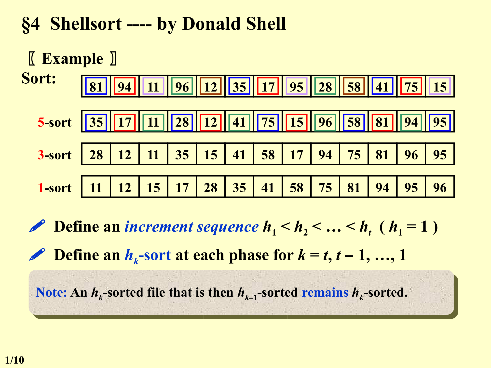
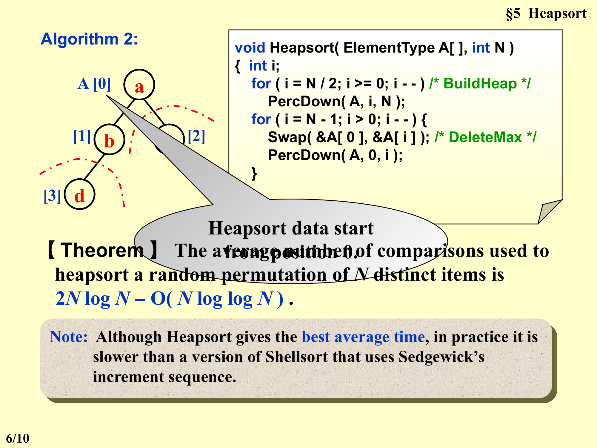
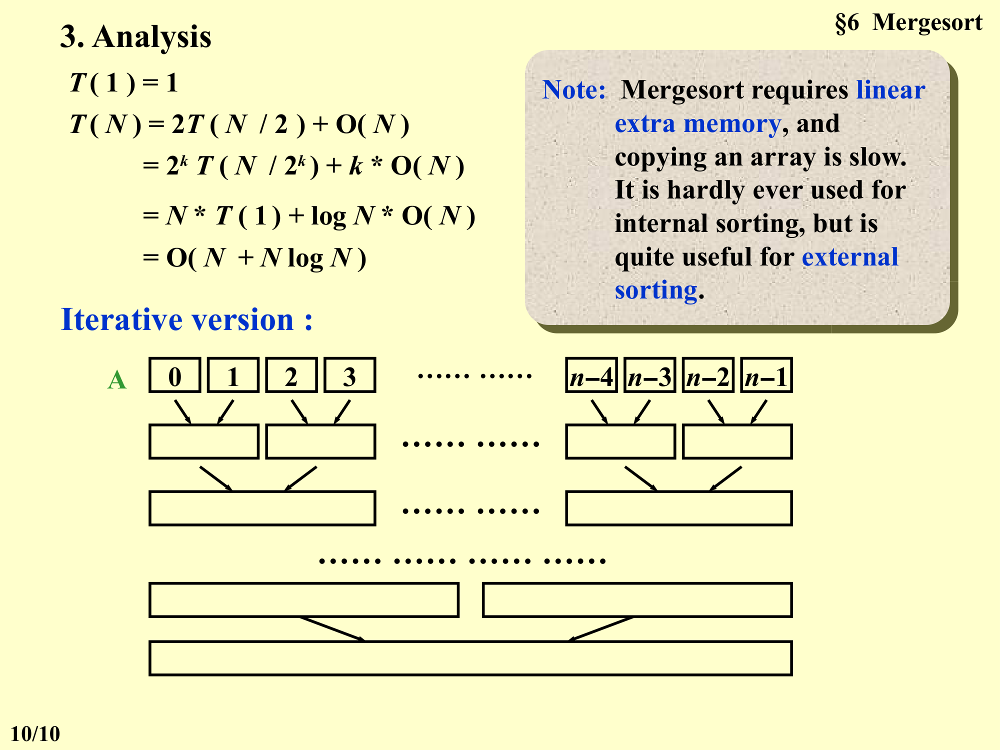
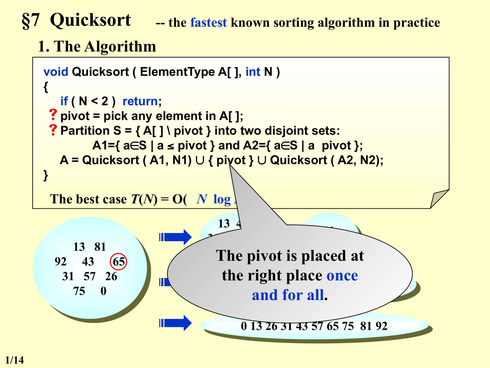
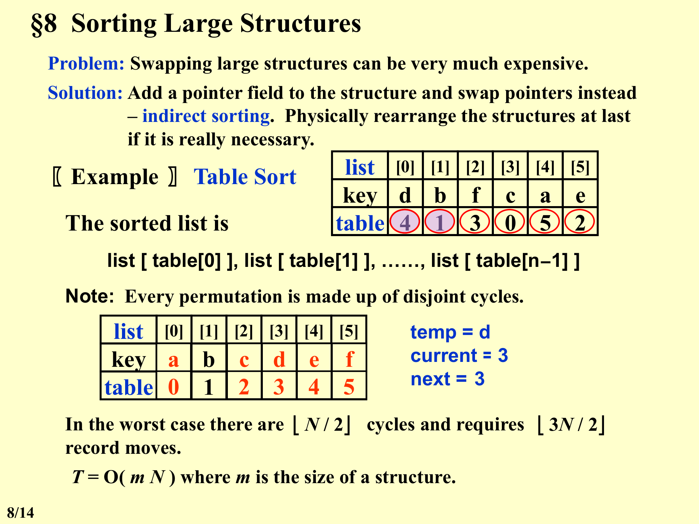
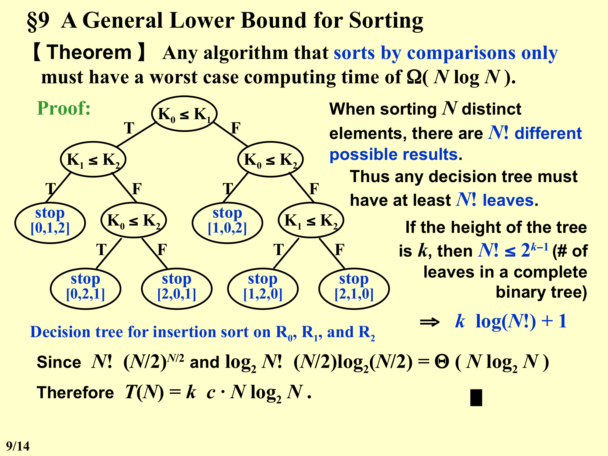

# 第6章：排序算法 (Chapter 6: Sorting Algorithms)

> **Comparison-based sorting** 基于比较的排序

---

## 目录

1. [§1 Preliminaries 预备知识](#1-preliminaries-预备知识)
2. [§2 Insertion Sort 插入排序](#2-insertion-sort-插入排序)
3. [§3 A Lower Bound for Simple Sorting Algorithms 简单排序算法的下界](#3-a-lower-bound-for-simple-sorting-algorithms-简单排序算法的下界)
4. [§4 Shellsort 希尔排序](#4-shellsort-希尔排序)
5. [§5 Heapsort 堆排序](#5-heapsort-堆排序)
6. [§6 Mergesort 归并排序](#6-mergesort-归并排序)
7. [§7 Quicksort 快速排序](#7-quicksort-快速排序)
8. [§8 Sorting Large Structures 大型结构排序 (Table Sort)](#8-sorting-large-structures-大型结构排序-table-sort)
9. [§9 A General Lower Bound for Sorting 排序的一般下界](#9-a-general-lower-bound-for-sorting-排序的一般下界)
10. [§10 Bucket Sort and Radix Sort 桶排序与基数排序](#10-bucket-sort-and-radix-sort-桶排序与基数排序)

---

## §1 Preliminaries 预备知识

### 排序函数接口

```c
void X_Sort(ElementType A[], int N)
```

- $N$ 必须是一个合法的整数 (legal integer)
- 为简化起见，假设输入是整数数组 (Assume integer array for the sake of simplicity)
- 唯一允许的操作：`>` 和 `<` 比较运算符 ('>' and '<' operators exist and are the only operations allowed on the input data)
- 仅考虑 **内部排序** (internal sorting)：整个排序可以在主存中完成 (The entire sort can be done in main memory)

---

## §2 Insertion Sort 插入排序

### 算法 (C语言实现)

```c
void InsertionSort(ElementType A[], int N)
{
    int j, P;
    ElementType Tmp;

    for (P = 1; P < N; P++) {
        Tmp = A[P];                  /* the next coming card */
        for (j = P; j > 0 && A[j - 1] > Tmp; j--)
            A[j] = A[j - 1];         /* shift sorted cards to provide a position
                                        for the new coming card */
        A[j] = Tmp;                  /* place the new card at the proper position */
    }  /* end for-P-loop */
}
```

### 思想

类似玩扑克牌时整理手牌：每次取一张新牌，在已排序的牌中找到合适的位置插入。

### 时间复杂度

| 情况 | 条件 | 时间复杂度 |
|------|------|-----------|
| **最坏情况** (Worst case) | 输入数组是**逆序** (reverse order) | $T(N) = O(N^2)$ |
| **最好情况** (Best case) | 输入数组已经**有序** (sorted order) | $T(N) = O(N)$ |

---

## §3 A Lower Bound for Simple Sorting Algorithms 简单排序算法的下界

### 逆序 (Inversion)

> **Definition**: An inversion in an array of numbers is any ordered pair $(i, j)$ having the property that $i < j$ but $A[i] > A[j]$.
> **定义**: **逆序对 (Inversion)** 在数组中是指满足 $i < j$ 但 $A[i] > A[j]$ 的有序对 $(i, j)$。

**Example** 输入列表 `34, 8, 64, 51, 32, 21` 有 **9** 个逆序对：

$(34,8), (34,32), (34,21), (64,51), (64,32), (64,21), (51,32), (51,21), (32,21)$

使用插入排序需要 **9** 次交换才能将此列表排序。

### 关键观察

- 交换两个相邻的逆序元素恰好消除一个逆序 (Swapping two adjacent elements that are out of place removes **exactly one** inversion)
- $T(N, I) = O(I + N)$，其中 $I$ 是原始数组中的逆序数
- 若列表**几乎有序** (almost sorted)，则插入排序很快

### 重要定理

> **Theorem 1**: The average number of inversions in an array of $N$ distinct numbers is $N(N - 1) / 4$.
> **定理 1**: 在 $N$ 个不同元素的数组中，**逆序 (Inversion)** 数量的平均值为 $N(N-1)/4$。

> **Theorem 2**: Any algorithm that sorts by exchanging adjacent elements requires $\Omega(N^2)$ time on average.
> **定理 2**: 任何通过交换**相邻元素 (adjacent elements)** 来排序的算法，平均情况下需要 $\Omega(N^2)$ 时间。

### 启发

- 对于仅执行**相邻交换** (adjacent exchanges) 的算法，排序时间至少为 $O(N^2)$
- 要想加速，必须每次交换**消除多于一个逆序** (eliminate more than just one inversion per exchange)
- 需要交换**距离较远**的元素 (swap elements that are far apart)

---

## §4 Shellsort 希尔排序

### 基本思想

- 定义增量序列 (increment sequence) $h_1 < h_2 < \dots < h_t$（其中 $h_1 = 1$）
- 在每个阶段 $k = t, t-1, \dots, 1$ 执行一次 **$h_k$-排序** (hk-sort)
- **重要性质**: 一个已经 $h_k$-排序的文件，再进行 $h_{k-1}$-排序后，仍然保持 $h_k$-排序 (An $h_k$-sorted file that is then $h_{k-1}$-sorted remains $h_k$-sorted.)

> [点击打开 Shellsort 交互式演示](images/shellsort-demo.html) — 逐步感受 5-sort → 3-sort → 1-sort 的过程

### 示例

初始序列: `81, 94, 11, 96, 12, 35, 17, 95, 28, 58, 41, 75, 15`

**5-sort** (增量为 5):
```
35, 41, 81, 17, 75, 94, 11, 15, 95, 28, 96, 12, 58
```

**3-sort** (增量为 3):
```
28, 35, 58, 75, 95, 12, 15, 17, 81, 11, 41, 94, 96
```

**1-sort** (增量为 1, 即普通插入排序):
```
11, 12, 15, 17, 28, 35, 41, 58, 75, 81, 94, 95, 96
```



### Shell's Increment Sequence (希尔原始增量序列)

$$h_t = \lfloor N / 2 \rfloor, \quad h_k = \lfloor h_{k+1} / 2 \rfloor$$

### 算法实现

```c
void Shellsort(ElementType A[], int N)
{
    int i, j, Increment;
    ElementType Tmp;

    for (Increment = N / 2; Increment > 0; Increment /= 2) {
        /* h sequence */
        for (i = Increment; i < N; i++) {   /* insertion sort */
            Tmp = A[i];
            for (j = i; j >= Increment; j -= Increment)
                if (Tmp < A[j - Increment])
                    A[j] = A[j - Increment];
                else
                    break;
            A[j] = Tmp;
        } /* end for-I and for-Increment loops */
    }
}
```

### 最坏情况分析 (Worst-Case Analysis)

> **Theorem**: The worst-case running time of Shellsort, using Shell's increments, is $\Theta(N^2)$.
> **定理**: 使用**希尔原始增量序列 (Shell's increments)** 的 **希尔排序 (Shellsort)** 最坏运行时间为 $\Theta(N^2)$。

**Example of a bad case** (N = 16):
输入: `1, 9, 2, 10, 3, 11, 4, 12, 5, 13, 6, 14, 7, 15, 8, 16`

| 阶段 | 结果 |
|------|------|
| 8-sort | `1, 9, 2, 10, 3, 11, 4, 12, 5, 13, 6, 14, 7, 15, 8, 16` (无变化) |
| 4-sort | `1, 9, 2, 10, 3, 11, 4, 12, 5, 13, 6, 14, 7, 15, 8, 16` (无变化) |
| 2-sort | `1, 9, 2, 10, 3, 11, 4, 12, 5, 13, 6, 14, 7, 15, 8, 16` (无变化) |
| 1-sort | `1, 2, 3, 4, 5, 6, 7, 8, 9, 10, 11, 12, 13, 14, 15, 16` |

**原因**: 增量对 (pairs of increments) 不一定互质 (not necessarily relatively prime)，因此较小的增量可能几乎没有效果 (the smaller increment can have little effect)。

### Hibbard's Increment Sequence (希巴德增量序列)

$$h_k = 2^k - 1$$

- 连续的增量没有公因子 (consecutive increments have no common factors)

> **Theorem**: The worst-case running time of Shellsort, using Hibbard's increments, is $\Theta(N^{3/2})$.
> **定理**: 使用**希巴德增量序列 (Hibbard's increments)** 的 Shellsort 最坏运行时间为 $\Theta(N^{3/2})$。

### 其他结论

- Shellsort 算法简单但分析极其复杂 (very simple algorithm, yet with an extremely complex analysis)
- 适用于中等规模输入（数万个元素）(good for sorting up to moderately large input - tens of thousands)

**猜想 (Conjectures)**:
- $T_{\text{avg - Hibbard}}(N) = O(N^{5/4})$

**Sedgewick's best sequence**: $\{1, 5, 19, 41, 109, \dots\}$
- 项的形式为 $9 \times 4^i - 9 \times 2^i + 1$ 或 $4^i - 3 \times 2^i + 1$
- $T_{\text{avg}}(N) = O(N^{7/6})$
- $T_{\text{worst}}(N) = O(N^{4/3})$

---

## §5 Heapsort 堆排序

### Algorithm 1 (朴素方案, 需额外空间)

```c
{
    BuildHeap(H);                   /* O(N) */
    for (i = 0; i < N; i++)
        TmpH[i] = DeleteMin(H);     /* O(log N) */
    for (i = 0; i < N; i++)
        H[i] = TmpH[i];             /* O(1) */
}
```

- 时间复杂度: $T(N) = O(N \log N)$
- 缺点: **空间需求翻倍** (The space requirement is doubled)

### Algorithm 2 (原地排序, In-place)

```c
void Heapsort(ElementType A[], int N)
{
    int i;
    for (i = N / 2; i >= 0; i--)    /* BuildHeap */
        PercDown(A, i, N);
    for (i = N - 1; i > 0; i--) {
        Swap(&A[0], &A[i]);         /* DeleteMax */
        PercDown(A, 0, i);
    }
}
```

- **关键点**: Heapsort data start from position 0.
- 建堆 (BuildHeap) 后，反复执行 DeleteMax，将最大值交换到数组末尾。



### 定理

> **Theorem**: The average number of comparisons used to heapsort a random permutation of $N$ distinct items is $2N \log N - O(N \log \log N)$.
> **定理**: 对 $N$ 个不同元素的随机排列进行**堆排序 (Heapsort)**，平均比较次数为 $2N \log N - O(N \log \log N)$。

### 注意

- 虽然 Heapsort 具有最优的平均时间复杂度，但在实际中它比使用 Sedgewick 增量序列的 Shellsort 版本要慢 (Although Heapsort gives the best average time, in practice it is slower than a version of Shellsort that uses Sedgewick's increment sequence.)

---

## §6 Mergesort 归并排序

### 1. 合并两个有序列表 (Merge Two Sorted Lists)

```
Aptr -> 1, 13, 24, 26
Bptr -> 2, 15, 27, 38
```

合并过程:
- 比较 Aptr 和 Bptr 指向的元素，取较小者放入 Cptr
- 1 < 2 → 取 1
- 2 < 13 → 取 2
- 13 < 15 → 取 13
- ...

$T(N) = O(N)$，其中 $N$ 是元素总数。

### 2. Mergesort 算法

```c
void MSort(ElementType A[], ElementType TmpArray[], int Left, int Right)
{
    int Center;
    if (Left < Right) {                 /* if there are elements to be sorted */
        Center = (Left + Right) / 2;
        MSort(A, TmpArray, Left, Center);            /* T(N / 2) */
        MSort(A, TmpArray, Center + 1, Right);       /* T(N / 2) */
        Merge(A, TmpArray, Left, Center + 1, Right); /* O(N) */
    }
}

void Mergesort(ElementType A[], int N)
{
    ElementType *TmpArray;              /* need O(N) extra space */
    TmpArray = malloc(N * sizeof(ElementType));
    if (TmpArray != NULL) {
        MSort(A, TmpArray, 0, N - 1);
        free(TmpArray);
    }
    else
        FatalError("No space for tmp array!!!");
}
```

**空间复杂度**: 如果在每次 Merge 调用中局部声明 `TmpArray`，则 $S(N) = O(N \log N)$。
更好的做法是只分配一次 `TmpArray`，空间复杂度为 $O(N)$。

### 3. Merge 函数

```c
/* Lpos = start of left half, Rpos = start of right half */
void Merge(ElementType A[], ElementType TmpArray[],
           int Lpos, int Rpos, int RightEnd)
{
    int i, LeftEnd, NumElements, TmpPos;

    LeftEnd = Rpos - 1;
    TmpPos = Lpos;
    NumElements = RightEnd - Lpos + 1;

    while (Lpos <= LeftEnd && Rpos <= RightEnd)  /* main loop */
        if (A[Lpos] <= A[Rpos])
            TmpArray[TmpPos++] = A[Lpos++];
        else
            TmpArray[TmpPos++] = A[Rpos++];

    while (Lpos <= LeftEnd)                     /* Copy rest of first half */
        TmpArray[TmpPos++] = A[Lpos++];

    while (Rpos <= RightEnd)                    /* Copy rest of second half */
        TmpArray[TmpPos++] = A[Rpos++];

    for (i = 0; i < NumElements; i++, RightEnd--)
        A[RightEnd] = TmpArray[RightEnd];       /* Copy TmpArray back */
}
```

### 4. 复杂度分析

递推关系:
$$T(1) = 1$$
$$T(N) = 2T(N/2) + O(N)$$

展开:
$$T(N) = 2^k T(N / 2^k) + k \cdot O(N)$$
$$= N \cdot T(1) + \log N \cdot O(N)$$
$$= O(N + N \log N) = O(N \log N)$$

### 重要说明

- Mergesort 需要线性额外内存 (linear extra memory)，并且复制数组较慢 (copying an array is slow)
- **几乎不用于内部排序** (hardly ever used for internal sorting)
- 但**非常适用于外部排序** (quite useful for external sorting)

### 迭代版本图示



---

## §7 Quicksort 快速排序

- 实践中已知最快的排序算法 (the fastest known sorting algorithm in practice)

### 1. 算法

```c
void Quicksort(ElementType A[], int N)
{
    if (N < 2) return;
    pivot = pick any element in A[];
    Partition S = { A[] \ pivot } into two disjoint sets:
        A1 = { a in S | a <= pivot } and A2 = { a in S | a >= pivot };
    A = Quicksort(A1, N1) U { pivot } U Quicksort(A2, N2);
}
```

- 主元 (pivot) 被放在最终的正确位置上，且只放一次 (The pivot is placed at the right place once and for all.)
- 最好情况: $T(N) = O(N \log N)$

**分区图解**:


```
13, 43, 31, 57, 26, 0, 81, 92, 75, 65

pivot = 65

A1 = {13, 43, 31, 57, 26, 0}
A2 = {81, 92, 75}

递归排序后:
0, 13, 26, 31, 43, 57, |65|, 75, 81, 92
```

### 2. 选择主元 (Picking the Pivot)

#### 错误方式 (A Wrong Way)
- `Pivot = A[0]`
- 最坏情况: 数组已经预排序 (presorted) → Quicksort 将需要 $O(N^2)$ 的时间**无事可做** (to do nothing)

#### 安全策略 (A Safe Maneuver)
- `Pivot = random select from A[]`
- 缺点: 随机数生成很昂贵 (random number generation is expensive)

#### 三数取中 (Median-of-Three Partitioning)
- `Pivot = median(left, center, right)`
- 消除了已排序输入的坏情况 (Eliminates the bad case for sorted input)
- 实际运行时间减少约 5% (actually reduces the running time by about 5%)

### 3. 分区策略 (Partitioning Strategy)

- 使用两个指针 $i$ 和 $j$，分别从左右向中间扫描
- $i$ 寻找大于 pivot 的元素，$j$ 寻找小于 pivot 的元素
- 当 $i < j$ 时交换 `A[i]` 和 `A[j]`
- 当 $i$ 和 $j$ 交错时停止

**关于相等元素 (keys == pivot) 的处理**:
- 如果 $i$ 和 $j$ 都不停止 → 没有交换，但序列无法被分成两个等大的子序列 → $T(N) = O(N^2)$
- 如果 $i$ 和 $j$ 都停止然后交换 → 会有许多无意义的交换 (dummy swaps)，但至少序列能被分成两个等大的子序列
- 因此更好的选择是：当遇到等于 pivot 的元素时，$i$ 和 $j$ **都停止** (stop both i and j and take some extra swaps)

### 4. 小数组处理 (Small Arrays)

- **问题**: Quicksort 在小规模数组 $(N \leq 20)$ 上比插入排序慢
- **解决方案**: 当 N 变小时（如 $N = 10$），使用切割阈值 (Cutoff)，改用其他高效算法（如插入排序）

### 5. 完整实现

```c
void Quicksort(ElementType A[], int N)
{
    Qsort(A, 0, N - 1);
    /* A: the array */
    /* 0: Left index */
    /* N - 1: Right index */
}
```

**Median3 函数** — 计算三数中值并隐藏主元:

```c
/* Return median of Left, Center, and Right */
/* Order these and hide the pivot */
ElementType Median3(ElementType A[], int Left, int Right)
{
    int Center = (Left + Right) / 2;

    if (A[Left] > A[Center])
        Swap(&A[Left], &A[Center]);
    if (A[Left] > A[Right])
        Swap(&A[Left], &A[Right]);
    if (A[Center] > A[Right])
        Swap(&A[Center], &A[Right]);

    /* Invariant: A[Left] <= A[Center] <= A[Right] */
    Swap(&A[Center], &A[Right - 1]);  /* Hide pivot */

    /* only need to sort A[Left + 1] ... A[Right - 2] */
    return A[Right - 1];  /* Return pivot */
}
```

**Qsort 主函数**:

```c
void Qsort(ElementType A[], int Left, int Right)
{
    int i, j;
    ElementType Pivot;

    if (Left + Cutoff <= Right) {  /* if the sequence is not too short */
        Pivot = Median3(A, Left, Right);  /* select pivot */
        i = Left;
        j = Right - 1;   /* why not set Left+1 and Right-2? */

        for (;;) {
            while (A[++i] < Pivot) {}  /* scan from left */
            while (A[--j] > Pivot) {}  /* scan from right */
            if (i < j)
                Swap(&A[i], &A[j]);   /* adjust partition */
            else
                break;                 /* partition done */
        }

        Swap(&A[i], &A[Right - 1]);    /* restore pivot */
        Qsort(A, Left, i - 1);         /* recursively sort left part */
        Qsort(A, i + 1, Right);        /* recursively sort right part */

    }  /* end if - the sequence is long */
    else
        /* do an insertion sort on the short subarray */
        InsertionSort(A + Left, Right - Left + 1);
}
```

### 6. 复杂度分析

递推关系:
$$T(N) = T(i) + T(N - i - 1) + cN$$

#### 最坏情况 (Worst Case)
- 每次分区产生一个大小为 0 和一个大小为 $N-1$ 的子数组
- $T(N) = T(N-1) + cN$
- $T(N) = O(N^2)$

#### 最好情况 (Best Case)
- 每次分区将数组均匀分成两半
- $T(N) = 2T(N/2) + cN$
- $T(N) = O(N \log N)$

#### 平均情况 (Average Case)
- 假设 $T(i)$ 对所有 $i$ 取平均值
- $T(N) = O(N \log N)$

### 应用: 寻找第 k 大元素

**【Example】** Given a list of $N$ elements and an integer $k$. Find the $k$th largest element.

---

## §8 Sorting Large Structures 大型结构排序 (Table Sort)

### 问题

交换大型结构可能非常昂贵 (Swapping large structures can be very much expensive.)

### 解决方案: 间接排序 (Indirect Sorting)

- 为结构添加一个**指针字段** (pointer field)，交换指针而不是整个结构
- 如果确实需要，最后再物理重排结构 (physically rearrange the structures at last)

### 示例: Table Sort

```
list:  [d, b, f, c, a, e]
table: [0, 1, 2, 3, 4, 5]  (初始状态)
```

- 排序后的列表为: `list[table[0]], list[table[1]], ..., list[table[n-1]]`

**排序后 table 变为**: `[4, 1, 3, 0, 5, 2]`
- `list[4] = a`, `list[1] = b`, `list[3] = c`, `list[0] = d`, `list[5] = e`, `list[2] = f`
- 输出: `a, b, c, d, e, f`

### 物理重排 (Physical Rearrangement)

**重要观察**: 每个排列由不相交的环组成 (Every permutation is made up of disjoint cycles.)

在 table `[4, 1, 3, 0, 5, 2]` 中:
- 环 1: `0 → 4 → 5 → 2 → 3 → 0` (5 个元素)
- 环 2: `1 → 1` (1 个元素，已在正确位置)

**重排过程**: 使用临时变量 `temp`，按照环的路径进行移动。



最坏情况下有 $\lfloor N/2 \rfloor$ 个环，需要 $\lfloor 3N/2 \rfloor$ 次记录移动 (record moves)。

$$T = O(mN)$$

其中 $m$ 是一个结构的大小 (size of a structure)。

---

## §9 A General Lower Bound for Sorting 排序的一般下界

> **Theorem**: Any algorithm that sorts by comparisons only must have a worst case computing time of $\Omega(N \log N)$.
> **定理**: 任何仅通过**比较 (comparisons)** 进行排序的算法，最坏情况计算时间至少为 $\Omega(N \log N)$。

### 证明 (通过决策树)

**决策树 (Decision Tree) 示例** — 对 R0, R1, R2 进行插入排序的决策树:



**推理过程**:
1. 排序 $N$ 个不同元素时，有 $N!$ 种不同的可能结果 (When sorting N distinct elements, there are N! different possible results.)
2. 因此任何**决策树 (decision tree)** 必须至少有 $N!$ 个**叶子 (leaves)** (any decision tree must have at least N! leaves)
3. 如果树的高度为 $k$，则 $N! \leq 2^{k-1}$（完全二叉树的最大叶子数）
4. $\Rightarrow k \geq \log(N!) + 1$
5. 由于 $N! \geq (N/2)^{N/2}$，有 $\log_2 N! \geq (N/2)\log_2(N/2) = \Theta(N \log_2 N)$
6. 因此 $T(N) = k \geq c \cdot N \log_2 N$

---

## §10 Bucket Sort and Radix Sort 桶排序与基数排序

### Bucket Sort 桶排序

**【Example】** 假设有 $N$ 个学生，每个学生有 0 到 100 之间的成绩（共 $M = 101$ 种可能的分数）。如何在线性时间内按成绩排序？

**算法**:
```c
Algorithm
{
    initialize count[];
    while (read in a student's record)
        insert to list count[stdnt.grade];
    for (i = 0; i < M; i++) {
        if (count[i])
            output list count[i];
    }
}
```

- 时间复杂度: $T(N, M) = O(M + N)$
- 问题: 如果 $M \gg N$ （桶数远大于元素数）怎么办？

**图解**:
```
count: [0] [1] ... [88] ... [100]
                    |
                 学生记录
```

### Radix Sort 基数排序

**【Example】** 给定 $N = 10$ 个整数，范围 0 到 999（$M = 1000$）。能否在线性时间内排序？

#### 思路：按最低有效位 (LSD) 排序

输入: `64, 8, 216, 512, 27, 729, 0, 1, 343, 125`

**B = 10 个桶（0-9），P = 3 趟（个位、十位、百位）**

| 桶 | Pass 1 (个位) | Pass 2 (十位) | Pass 3 (百位) |
|---|-------------|-------------|-------------|
| 0 | 0 | 0, 1, 8 | 0, 1, 8, 27, 64 |
| 1 | 1 | 512, 216 | 125 |
| 2 | 512 | 125, 27, 729 | 216 |
| 3 | 343 | | 343 |
| 4 | 64 | 343 | |
| 5 | 125 | | 512 |
| 6 | 216 | 64 | |
| 7 | 27 | | 729 |
| 8 | 8 | | |
| 9 | 729 | | |

- **Pass 1** (按个位): `0, 1, 512, 343, 64, 125, 216, 27, 8, 729`
- **Pass 2** (按十位): `0, 1, 8, 512, 216, 125, 27, 729, 343, 64`
- **Pass 3** (按百位): `0, 1, 8, 27, 64, 125, 216, 343, 512, 729`

**输出**: `0, 1, 8, 27, 64, 125, 216, 343, 512, 729`

**时间复杂度**: $T = O(P(N + B))$

其中:
- $P$ = 趟数 (number of passes)
- $N$ = 待排序元素数
- $B$ = 桶数 (number of buckets)

### 多关键字排序 (Multiple Keys Sorting)

假设记录 $R_i$ 有 $r$ 个关键字:
- $K_i^j$ = 记录 $R_i$ 的第 $j$ 个关键字
- $K_i^0$ = 最高位关键字 (most significant key)
- $K_i^{r-1}$ = 最低位关键字 (least significant key)

词典顺序 (Lexical order): 列表 $R_0, \dots, R_{n-1}$ 关于关键字 $K^0, K^1, \dots, K^{r-1}$ 是词典排序的，当且仅当存在某个 $l < r-1$ 使得 $K_i^0 = K_{i+1}^0, \dots, K_i^l = K_{i+1}^l$ 且 $K_i^{l+1} < K_{i+1}^{l+1}$。

**【Example】** 一副扑克牌按两个关键字排序:
- $K^0$ [花色 Suit]: $\spadesuit < \heartsuit < \diamondsuit < \clubsuit$
- $K^1$ [面值 Face value]: $2 < 3 < 4 < 5 < 6 < 7 < 8 < 9 < 10 < J < Q < K < A$

**排序结果**:
$2\spadesuit \dots A\spadesuit \ 2\heartsuit \dots A\heartsuit \ 2\diamondsuit \dots A\diamondsuit \ 2\clubsuit \dots A\clubsuit$

### MSD (Most Significant Digit) 最高位优先排序

1. 按 $K^0$ 排序：创建 4 个桶（对应 4 种花色）
2. 每个桶内独立排序（使用任意排序技术）

```
[spade bucket] 3 spades
[heart bucket] 5 hearts
[diamond bucket] 4 diamonds
[club bucket] A club
```

### LSD (Least Significant Digit) 最低位优先排序

1. 按 $K^1$（面值）排序：创建 13 个桶
2. 重新合为一叠
3. 创建 4 个桶（按花色）并重新排序

**问题**: LSD 是否总是比 MSD 快？(Is LSD always faster than MSD?)

---

## 算法总结

| 算法 | 最坏时间 | 平均时间 | 最好时间 | 空间 | 稳定性 |
|------|---------|---------|---------|------|-------|
| **Insertion Sort** | $O(N^2)$ | $O(N^2)$ | $O(N)$ | $O(1)$ | 稳定 |
| **Shellsort** (Shell 增量) | $\Theta(N^2)$ | - | - | $O(1)$ | 不稳定 |
| **Shellsort** (Hibbard 增量) | $\Theta(N^{3/2})$ | $O(N^{5/4})$ (猜想) | - | $O(1)$ | 不稳定 |
| **Shellsort** (Sedgewick) | $O(N^{4/3})$ | $O(N^{7/6})$ | - | $O(1)$ | 不稳定 |
| **Heapsort** | $O(N \log N)$ | $O(N \log N)$ | $O(N \log N)$ | $O(1)$ | 不稳定 |
| **Mergesort** | $O(N \log N)$ | $O(N \log N)$ | $O(N \log N)$ | $O(N)$ | 稳定 |
| **Quicksort** | $O(N^2)$ | $O(N \log N)$ | $O(N \log N)$ | $O(\log N)$ | 不稳定 |
| **Bucket Sort** | $O(M+N)$ | $O(M+N)$ | $O(M+N)$ | $O(M+N)$ | 稳定 |
| **Radix Sort** | $O(P(N+B))$ | $O(P(N+B))$ | $O(P(N+B))$ | $O(N+B)$ | 稳定 |

### 说明

- **稳定性** (Stability): 如果两个相等的关键字在排序前后的相对顺序保持不变，则该排序算法是稳定的
- 比较排序的下界: $\Omega(N \log N)$ (所有基于比较的排序算法)
- 非比较排序 (Bucket Sort, Radix Sort) 可以突破 $O(N \log N)$ 的下界

---

## 补充: Replacement Selection (置换选择)

*Bonus Problem (2 points), Due: Tuesday, June 16th, 2026 at 10:00pm*
- 可在 https://pintia.cn/ 找到并提交
