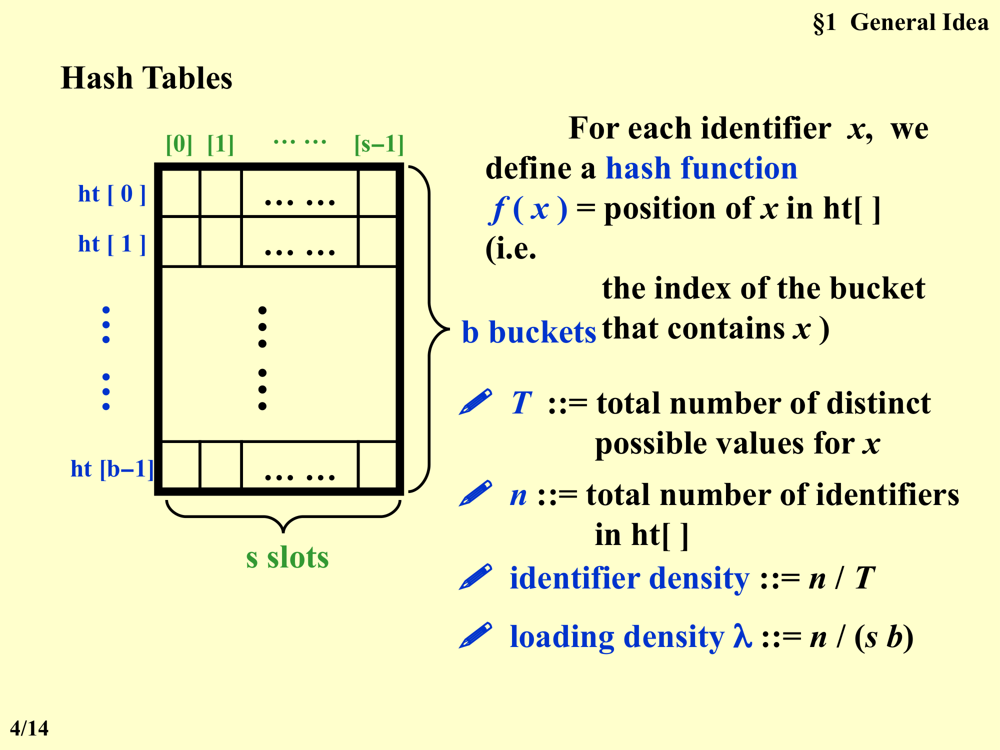
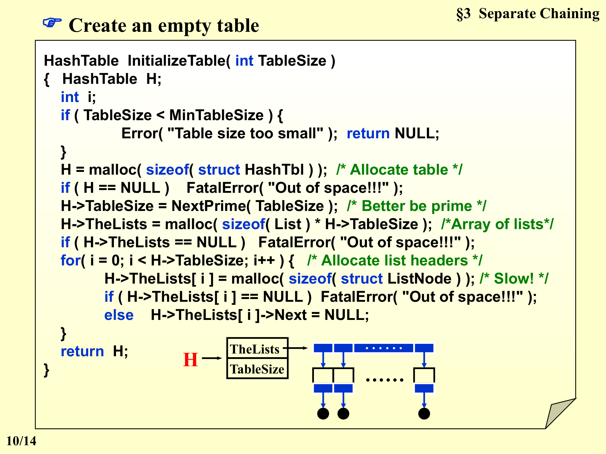
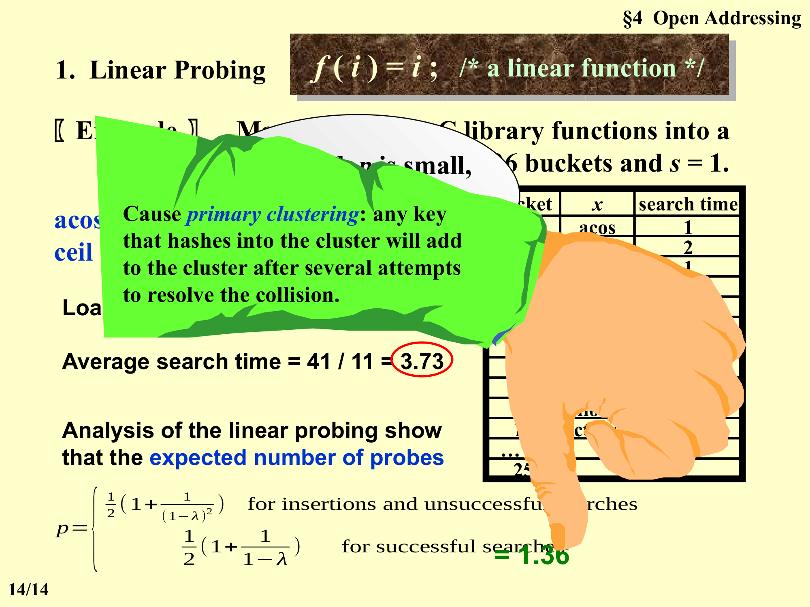
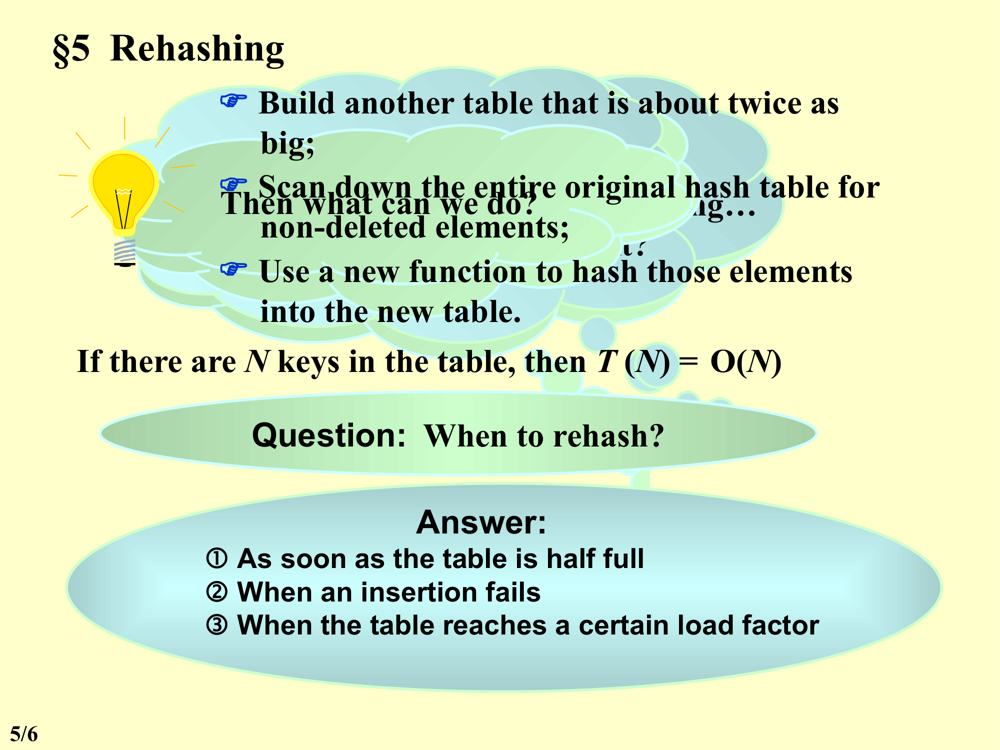

# 第7章：哈希 (Chapter 7: Hashing)

> **Search by Formula (公式查找)** — 不通过比较 (comparison)，而是通过一个函数直接计算出存储位置。

---

## Overview / 概述

有一个定理说："任何**仅通过比较 (comparison)** 进行排序的算法，其最坏情况时间复杂度为 $\Omega(n \log_2 n)$。"

但是我们已经有了：
- **二分查找 (Binary Search)**: $O(\ln n)$ — 需要先排序
- **排序算法 (Sorting)**: 最优时间 $O(n \ln n)$

**那么问题来了**：谁说 $O(n \ln n)$ 是查找的最优时间？
**答案**：我们还可以**不做比较，做别的事情**！

### 插值查找 (Interpolation Search)

在有序列表 (sorted list) $f[l].key, f[l+1].key, \dots, f[u].key$ 中查找 key：
- 如果 $f[i].key < key$，则 $l = i$；
- 否则 $u = i$。
- 利用插值公式猜测位置 $i$（而非二分法固定取中间）。

---

## Section 1: General Idea (一般概念)

### 符号表 (Symbol Table / Dictionary)

**Definition (定义)**：A **Symbol Table** is a set of `< name, attribute >` pairs, where names are unique.

符号表是一组 `< name, attribute >` 对，其中名字是唯一的。

**Examples (示例)**：
- **牛津英语词典 (Oxford English Dictionary)**：`name = "since"`, `attribute = 含义列表`
  - M[0] = after a date, event, etc.
  - M[1] = seeing that (expressing reason)
  - ......
- **编译器符号表 (Compiler Symbol Table)**：`name = identifier (e.g., int)`, `attribute = 使用该标识符的行列表及其他信息`

### 符号表 ADT (Symbol Table ADT)

**Objects (对象)**：一组 name-attribute 对，names 唯一。

**Operations (操作)**：

| 操作 (Operation) | 描述 (Description) |
|------|------|
| `SymTab Create(TableSize)` | 创建大小为 TableSize 的符号表 |
| `Boolean IsIn(symtab, name)` | 判断 name 是否在表中 |
| `Attribute Find(symtab, name)` | 查找 name 对应的属性 |
| `SymTab Insert(symtab, name, attr)` | 插入新的 name-attribute 对 |
| `SymTab Delete(symtab, name)` | 删除指定 name |

### 哈希表 (Hash Tables)

对于每个标识符 $x$，定义一个**哈希函数 (Hash Function)** $f(x)$ = $x$ 在哈希数组 `ht[]` 中的位置（即包含 $x$ 的**桶 (bucket)** 的索引）。

**哈希表结构图示 (Hash Table Structure)**：



```
ht[0]  → [ slot 0 | slot 1 | ... | slot s-1 ]
ht[1]  → [ ... ]
...
ht[b-1] → [ ... ]
```

- $b$ = **buckets**（桶的数量）
- $s$ = **slots**（每个桶的槽位数）
- $T$ = **Identifier Space** — 所有可能的不同 $x$ 的总数（标识符空间大小）
- $n$ = 当前哈希表中的标识符总数

**重要密度定义 (Density Definitions)**：

| 术语 (Term) | 公式 (Formula) | 说明 |
|------|------|------|
| **Identifier Density (标识符密度)** | $n / T$ | 已使用标识符占全部可能标识符的比例 |
| **Loading Density $\lambda$ (负载密度)** | $n / (s \cdot b)$ | 已占用的槽位占总槽位的比例 |

### 冲突与溢出 (Collision and Overflow)

| 术语 (Term) | 定义 (Definition) |
|------|------|
| **Collision (冲突)** | When two distinct identifiers $i_1 \neq i_2$ are hashed into the same bucket, i.e., $f(i_1) = f(i_2)$. 当两个不同的标识符被哈希到同一个桶时。 |
| **Overflow (溢出)** | When a new identifier is hashed into a **full** bucket. 当一个新标识符被哈希到一个已满的桶时。 |

> **Note**: 当 $s = 1$（每个桶只有 1 个槽位）时，Collision 和 Overflow 同时发生。

**示例 (Example)**：将 $n = 10$ 个 C 库函数映射到哈希表 `ht[]`，$b = 26$ 个桶，$s = 2$ 个槽位。

**Loading Density (负载密度)**: $\lambda = 10 / (2 \times 26) = 10 / 52 = 0.19$

**Hash Function (哈希函数)**：$f(x) = x[0] - \text{'a'}$（将字母 a~z 映射到 0~25）。

**映射结果 (Mapping Result)**：

| Bucket | Slot 0 | Slot 1 |
|--------|--------|--------|
| 0 (a) | acos | atan |
| 1 (b) | | |
| 2 (c) | char | ceil |
| 3 (d) | define | |
| 4 (e) | | |
| 5 (f) | float | exp |
| ... | ... | ... |
| 25 (z) | | |

具体映射：
- acos → bucket 0 (slot 0)
- atan → bucket 0 (slot 1)
- char → bucket 2 (slot 0)
- ceil → bucket 2 (slot 1)
- define → bucket 3 (slot 0)
- float → bucket 5 (slot 0)
- exp → bucket 5 (slot 1)
- floor, clock, ctime → 其他位置

> **关键结论 (Key Conclusion)**：如果没有溢出 (overflow)，则**查找、插入、删除的时间复杂度均为 $O(1)$**。

---

## Section 2: Hash Function (哈希函数)

### 理想哈希函数的性质 (Properties of an Ideal Hash Function)

1. **$f(x)$ 必须容易计算 (easily computable)**，并且最小化冲突次数 (minimize the number of collisions)。
2. **$f(x)$ 应当是无偏的 (unbiased)**：对于任意 $x$ 和任意 $i$，有 $\text{Probability}(f(x) = i) = 1/b$。这样的哈希函数称为**均匀哈希函数 (Uniform Hash Function)**。

### 常见的哈希函数 (Common Hash Functions)

#### 1. 整数键的哈希 (Hash Function for Integer Keys)

$$f(x) = x \;\%\; \text{TableSize}$$

- **Problem (问题)**：如果 TableSize = 10，且所有 $x$ 都以 0 结尾（如 10, 20, 30...），则所有键都映射到同一位置。
- **Solution (解决方案)**：**TableSize 应选为质数 (prime number)** — 对随机整数键效果良好。

#### 2. 字符串键的哈希 — 简单求和 (Simple Sum for String Keys)

$$f(x) = \left( \sum x[i] \right) \;\%\; \text{TableSize}$$

**示例 (Example)**：TableSize = 10,007，字符串长度 $\leq 8$，$x[i] \in [0, 127]$。
- $f(x)$ 的取值范围：$[0, 1016]$（结论：范围太小，冲突概率大）。

#### 3. 基于 27 进制的哈希 (Base-27 Hash)

$$f(x) = (x[0] + x[1] \times 27 + x[2] \times 27^2) \;\%\; \text{TableSize}$$

- 总组合数：$26^3 = 17,576$
- 实际组合数：$< 3,000$
- 局限：仅考虑前 3 个字符。

#### 4. 基于 32 进制的哈希（推荐）(Base-32 Hash — Recommended)

$$f(x) = \left( \sum x[N-i-1] \times 32^i \right) \;\%\; \text{TableSize}$$

使用 $32$ 因为 $32 = 2^5$，可用移位操作替代乘法（比 `*27` 更快）。

**C 代码实现 (C Implementation)**：
```c
Index Hash3(const char *x, int TableSize)
{
    unsigned int HashVal = 0;
    /* 1 */ while (*x != '\0')
    /* 2 */     HashVal = (HashVal << 5) + *x++;
    /* 3 */ return HashVal % TableSize;
}
```

**注意 (Notes)**：
- 可以**精心选择字符串中的部分字符**来加快计算。
- 如果 $x$ 太长（如街道地址），早期字符会被左移出去而丢失影响。

---

## Section 3: Separate Chaining (分离链接法)

**核心思想 (Core Idea)**：将所有哈希到**同一个值**的键保存在一个**链表 (linked list)** 中。

### 数据结构定义 (Data Structure Definition)

```c
struct ListNode;
typedef struct ListNode *Position;
struct HashTbl;
typedef struct HashTbl *HashTable;

struct ListNode {
    ElementType Element;
    Position Next;
};

typedef Position List;
/* List *TheList will be an array of lists, allocated later */
/* The lists use headers (for simplicity), though this wastes space */

struct HashTbl {
    int TableSize;
    List *TheLists;
};
```

**结构示意图 (Structure Diagram)**：

```
HashTable H
  ├── TableSize
  └── TheLists → [List0] → (header) → node1 → node2 → ...
                 [List1] → (header) → ...
                 [List2] → (header) → ...
                 ...
```



### 操作实现 (Operation Implementations)

#### 1. 创建空表 — InitializeTable

```c
HashTable InitializeTable(int TableSize)
{
    HashTable H;
    int i;

    if (TableSize < MinTableSize) {
        Error("Table size too small");
        return NULL;
    }

    H = malloc(sizeof(struct HashTbl));          /* Allocate table */
    if (H == NULL) FatalError("Out of space!!!");

    H->TableSize = NextPrime(TableSize);         /* Better be prime */

    H->TheLists = malloc(sizeof(List) * H->TableSize); /* Array of lists */
    if (H->TheLists == NULL) FatalError("Out of space!!!");

    for (i = 0; i < H->TableSize; i++) {         /* Allocate list headers */
        H->TheLists[i] = malloc(sizeof(struct ListNode)); /* Slow! */
        if (H->TheLists[i] == NULL)
            FatalError("Out of space!!!");
        else
            H->TheLists[i]->Next = NULL;
    }
    return H;
}
```

#### 2. 查找 — Find

```c
Position Find(ElementType Key, HashTable H)
{
    Position P;
    List L;

    L = H->TheLists[Hash(Key, H->TableSize)];  /* 调用哈希函数找到链表 */

    P = L->Next;
    while (P != NULL && P->Element != Key)     /* 可能需要 strcmp */
        P = P->Next;
    return P;
}
```

**说明 (Note)**：此代码与通用 List ADT 的 Find 操作完全相同。

#### 3. 插入 — Insert

```c
void Insert(ElementType Key, HashTable H)
{
    Position Pos, NewCell;
    List L;

    Pos = Find(Key, H);
    if (Pos == NULL) {     /* Key is not found, then insert */
        NewCell = malloc(sizeof(struct ListNode));
        if (NewCell == NULL) FatalError("Out of space!!!");
        else {
            L = H->TheLists[Hash(Key, H->TableSize)];
            NewCell->Next = L->Next;
            NewCell->Element = Key;    /* 可能需要 strcpy! */
            L->Next = NewCell;
        }
    }
}
```

**注意 (Note)**：插入操作采用**头插法 (insert at the front of the linked list)**。

### 性能提示 (Performance Tip)

> **Tip**: 让 TableSize 约等于期望的键的数量（即保持负载密度 **Loading Density** $\lambda \approx 1$）。

---

## Section 4: Open Addressing (开放地址法)

**核心思想 (Core Idea)**：不利用指针 (no pointers used)，当冲突发生时寻找**另一个空单元 (another empty cell)** 来解决。

### 通用插入算法 (General Insert Algorithm)

```
Algorithm: insert key into an array of hash table
{
    index = hash(key);
    initialize i = 0;                // 探测计数器 (probe counter)
    while (collision at index) {
        index = (hash(key) + f(i)) % TableSize;
        if (table is full) break;
        else i++;
    }
    if (table is full)
        ERROR("No space left");
    else
        insert key at index;
}
```

- $f(i)$ 是**冲突解决函数 (Collision Resolving Function)**
- $f(0) = 0$
- **Tip**: 通常保持 $\lambda < 0.5$

### 1. 线性探测 (Linear Probing)

$$f(i) = i$$

**示例 (Example)**：将 $n = 11$ 个 C 库函数映射到哈希表，$b = 26$ 个桶，$s = 1$。

**Hash Function (哈希函数)**：$f(x) = x[0] - \text{'a'}$

| 函数 | 哈希值 | 探测过程 (Probing Process) | 比较次数 |
|------|--------|----------|----------|
| acos | 0 | 直接放入 | 1 |
| atoi | 0 | 位置0被acos占用 → 1（空） | 2 |
| char | 2 | 直接放入 | 1 |
| define | 3 | 直接放入 | 1 |
| exp | 4 | 直接放入 | 1 |
| ceil | 2 | 位置2有char → 3有define → 4有exp → 5（空） | 4 |
| cos | 2 | 位置2有char → 3有define → 4有exp → 5有ceil → 6 → 7（空） | 5 |
| float | 5 | 位置5有ceil → 6（空） | 3 |
| atol | 0 | 0有acos → 1有atoi → 2有char → 3有define → 4有exp → 5有ceil → 6有float → 7有cos → 8 → 9（空） | 9 |
| floor | 5 | 5有ceil → 6有float → 7有cos → 8 → 9（空） | 5 |
| ctime | 2 | 2有char → 3有define → 4有exp → 5有ceil → 6有float → 7有cos → 8 → 9（空） | 9 |

**Loading Density (负载密度)**: $\lambda = 11 / 26 = 0.42$

**平均查找时间 (Average Search Time)** = $41 / 11 = 3.73$

> 理论分析表明，线性探测的期望探测次数约为 $\frac{1}{2}\left(1 + \frac{1}{1-\lambda}\right)$，当 $\lambda = 0.42$ 时约为 1.36。

#### 线性探测的问题：**Primary Clustering (一次聚集)**

**Definition (定义)**：Any key that hashes into a cluster will require several attempts to resolve the collision, and then it will **add to the cluster**.

任何哈希到集群中的键，都需要多次探测才能解决冲突，从而**使集群变得更大**。

**图示说明 (Illustration)**：



随着插入变多，连续被占用的桶形成"集群 (cluster)"，即使 $\lambda$ 很小，最坏情况也可能变得**非常大**。

---

### 2. 二次探测 (Quadratic Probing)

$$f(i) = i^2$$

#### 核心定理 (Core Theorem)

> **【Theorem 7.1 (Quadratic Probing Theorem)】** If quadratic probing is used, **and the table size is prime**, then a new element can always be inserted if **the table is at least half empty**.
>
> 如果使用二次探测，**且表大小为质数**，则当**表至少一半为空**时，总能插入一个新元素。

**Proof (证明)**：
只需证明前 $\lfloor \text{TableSize}/2 \rfloor$ 个备选位置都是**互不相同**的。即对于任意 $0 < i \neq j \leq \lfloor \text{TableSize}/2 \rfloor$，有：

$$(h(x) + i^2) \;\%\; \text{TableSize} \neq (h(x) + j^2) \;\%\; \text{TableSize}$$

**反证法 (Proof by Contradiction)**：
假设相等，即 $h(x) + i^2 \equiv h(x) + j^2 \pmod{\text{TableSize}}$

则 $i^2 \equiv j^2 \pmod{\text{TableSize}}$

即 $(i + j)(i - j) \equiv 0 \pmod{\text{TableSize}}$

因为 TableSize 是质数 (prime)，所以 $(i + j)$ 或 $(i - j)$ 必有一个能被 TableSize 整除。

由于 $0 < i \neq j \leq \lfloor \text{TableSize}/2 \rfloor$，我们有：
- $0 < i + j < \text{TableSize}$，所以 $(i + j)$ 不能被 TableSize 整除
- $0 < |i - j| < \text{TableSize}$，所以 $(i - j)$ 不能被 TableSize 整除

**矛盾 (Contradiction)！** 因此所有备选位置各不相同。

对于任意 $x$，有 $\lceil \text{TableSize}/2 \rceil$ 个互不相同的探测位置。如果最多 $\lfloor \text{TableSize}/2 \rfloor$ 个位置已被占用，则总能找到空位。

#### 特殊质数表大小的二次探测

> **Note**: 如果表大小为 $4k + 3$ 形式的质数，则二次探测 $f(i) = \pm i^2$ 可以探测**整个表**。

#### 二次探测的 Find 操作实现 (Find Implementation for Quadratic Probing)

```c
Position Find(ElementType Key, HashTable H)
{
    Position CurrentPos;
    int CollisionNum;

    CollisionNum = 0;
    CurrentPos = Hash(Key, H->TableSize);

    while (H->TheCells[CurrentPos].Info != Empty &&
           H->TheCells[CurrentPos].Element != Key) {
        CurrentPos += 2 * ++CollisionNum - 1;   /* f(i) = f(i-1) + 2i - 1 */
        if (CurrentPos >= H->TableSize)
            CurrentPos -= H->TableSize;         /* 比 mod 更快 */
    }
    return CurrentPos;
}
```

**优化说明 (Optimization Notes)**：
- 利用递推公式 $f(i) = f(i-1) + 2i - 1$，避免每次计算 $i^2$
- 其中 `2*` 实际可用位运算（左移一位）
- 由于探测步数 $i$ 不超过 $\text{TableSize}/2 + 1$（即假设表 < 50% 满），此时 `CurrentPos + 2i - 1 <= 2*TableSize - 1`，所以可用**减法**代替取模

**注意 (Caution)**: 代码中关于条件判断的顺序：
- 如果是 Empty，则 key 没有定义，**先判断会出错**
- 应当先检查 Info 是否为 Legitimate，再比较 Element

#### 二次探测的 Insert 操作实现 (Insert Implementation for Quadratic Probing)

```c
void Insert(ElementType Key, HashTable H)
{
    Position Pos;
    Pos = Find(Key, H);
    if (H->TheCells[Pos].Info != Legitimate) {  /* OK to insert here */
        H->TheCells[Pos].Info = Legitimate;
        H->TheCells[Pos].Element = Key;         /* 可能需要 strcpy */
    }
}
```

#### 二次探测的问题 (Problem with Quadratic Probing)

**Q (问题)**: 如何删除一个键 (How to delete a key)？
**A (回答)**: 不能直接删除，需要使用**惰性删除 (Lazy Deletion)** — 标记为 Deleted 而非真正删除。

**注意 (Notes)**：
1. 如果插入和删除操作频繁交替，Insert 操作会**严重变慢**（因为标记为 Deleted 的单元被视为已被占用，导致探测链中断）。
2. 虽然解决了 **Primary Clustering (一次聚集)**，但 **Secondary Clustering (二次聚集)** 仍然存在——即哈希到同一位置的键会探测相同的备选单元序列。

---

### 3. 双哈希 (Double Hashing)

$$f(i) = i \times \text{hash}_2(x)$$

其中 $\text{hash}_2(x)$ 是**第二个哈希函数 (second hash function)**。

#### 要求 (Requirements)
- $\text{hash}_2(x) \neq 0$
- 确保可以探测到所有单元 (guarantee that all cells will be probed)

#### 推荐实现 (Recommended Implementation)

$$\text{hash}_2(x) = R - (x \;\%\; R)$$

其中 $R$ 是小于 TableSize 的质数 (a prime smaller than TableSize)。

#### 性能比较 (Performance Comparison)

| 特性 | 双哈希 (Double Hashing) | 二次探测 (Quadratic Probing) |
|------|--------|----------|
| 期望探测次数 | 接近随机冲突解决策略 | 略高于随机策略 |
| 需要第二个哈希函数 | 是 | 否 |
| 实现复杂度 | 较高 | 较低 |
| 实际速度 | 较慢（因需计算第二个哈希值） | **更快**且更简单 |

> **Note**: 如果正确实现双哈希，模拟结果表明其期望探测次数几乎与随机冲突解决策略相同。但二次探测因不需要第二个哈希函数，在实际中更简单、更快。

---

## Section 5: Rehashing (再哈希)

### 为什么需要 Rehashing？(Why Rehashing?)

当表变得**超过一半满 (more than half full)** 时：
- 插入可能失败（二次探测要求表至少一半为空）
- 即使插入成功，性能也会严重下降

### Rehashing 的步骤 (Steps of Rehashing)

1. **Build a new table about twice as large (建立一个大约是原表两倍大的新表)**
2. **Scan the entire original hash table (扫描整个原哈希表)**，找到所有未被删除的元素
3. **Use a new hash function (使用新的哈希函数)** 将这些元素重新哈希到新表中

### 何时进行 Rehashing？(When to Rehash?)

| 策略 (Strategy) | 说明 (Description) |
|------|------|
| ① 表刚达到一半满时 (As soon as the table is half full) | 最保守，保证性能 |
| ② 插入失败时 (When an insertion fails) | 被动触发 |
| ③ 表达到某个特定负载因子时 (When the table reaches a certain load factor) | 灵活控制 |

### 时间复杂度 (Time Complexity)

如果表中有 $N$ 个键，Rehashing 的时间复杂度 $T(N) = O(N)$。

### 平摊分析 (Amortized Analysis)

> **Note**: 通常在进行 Rehash 之前已经有 $N/2$ 次插入操作，因此 $O(N)$ 的 Rehash 时间**平摊 (amortized)** 到每次插入上只是**常数级额外开销 (constant additional cost)**。

**但需注意**: 在交互式系统中，触发 Rehash 的那次插入操作的用户会**感受到明显的延迟 (visible delay)**。

### 示例图示 (Example Illustration)

Rehashing 的流程：



---

## Summary / 总结

### 三种冲突解决策略对比 (Comparison of Three Collision Resolution Strategies)

| 策略 (Strategy) | 方法 (Method) | 优点 (Advantages) | 缺点 (Disadvantages) |
|------|------|------|------|
| **Separate Chaining** | 链表存储同桶元素 | 实现简单，$\lambda$ 可 > 1 | 需要指针 (pointers)，额外空间 |
| **Linear Probing** | $f(i) = i$ | 实现简单 | Primary Clustering |
| **Quadratic Probing** | $f(i) = i^2$ | 无 Primary Clustering | Secondary Clustering；表必须至少半空 |
| **Double Hashing** | $f(i) = i \cdot h_2(x)$ | 接近随机探测 | 需计算第二个哈希函数 |

### 关键要点 (Key Points)

1. **TableSize 应选为质数 (prime number)** — 对哈希分布有重要意义
2. **负载密度 Loading Density $\lambda$** 直接影响性能：
   - Separate Chaining: $\lambda \approx 1$ 推荐
   - Open Addressing: 通常 $\lambda < 0.5$
3. **二次探测 (Quadratic Probing)** 是实践中常用的折衷方案
4. **再哈希 (Rehashing)** 解决表满问题，平摊成本为 $O(1)$ 每次插入
5. 理想的哈希函数应当是**均匀的 (uniform)** 且**易于计算 (easily computable)**
